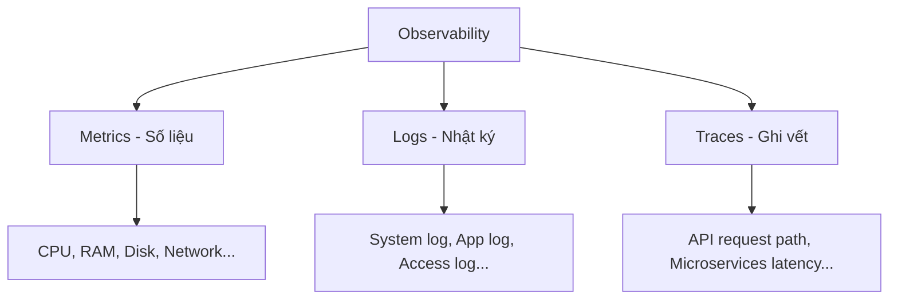

# 1. Why Monitor System (Tại sao cần giám sát hệ thống?)

Hệ thống được thiết kế và xây dựng tốt đến đâu thì vẫn sẽ tiềm ẩn các nguy cơ gặp sự cố. Nhiệm vụ của giám sát (monitor) là theo dõi sức khoẻ của hệ thống, phát hiện những vấn đề kịp thời, từ đó đưa ra các hành động hợp lý như thông báo cho quản trị viên hoặc recovery action.

---

## I. Tại sao cần giám sát hệ thống?

### 1. Đảm bảo tính ổn định và khả năng tự phục hồi
* Theo dõi sức khoẻ của hệ thống giúp phát hiện các vấn đề kịp thời.
* Kích hoạt các hành động tự động khắc phục (recovery action) hoặc thông báo cho quản trị viên để xử lý nhanh chóng.

### 2. Thích ứng với biến động tải (Workload)
* Nhu cầu truy cập và workload của các tài nguyên (resource) sẽ biến động không ngừng theo thời gian.
* Cần có cơ chế giám sát để có hành động ứng phó kịp thời, tránh các sự cố như:
  * Thiếu hụt tài nguyên hệ thống.
  * Workload quá cao làm chậm hệ thống và giảm trải nghiệm người dùng.

### 3. Tiền đề để hệ thống tự động co giãn (Auto-scale)
* Việc giám sát liên tục trạng thái của các tài nguyên chính là cơ sở và điều kiện tiên quyết để hệ thống có thể kích hoạt cơ chế tự động tăng/giảm quy mô (auto-scale) một cách chính xác.

---

## II. Các cột trụ của khả năng quan sát (Observability Pillars)

Một hệ thống giám sát toàn diện cần dựa trên 3 yếu tố cốt lõi (thường gọi là **MEL**):

* **Metrics (Số liệu đo lường):** Các giá trị số đo lường hiệu năng của tài nguyên theo thời gian (ví dụ: tỉ lệ sử dụng CPU, dung lượng RAM trống).
* **Logs (Nhật ký sự kiện):** Ghi chép chi tiết về các sự kiện xảy ra trong hệ thống tại một mốc thời gian cụ thể (ví dụ: nginx access log, application error stack trace).
* **Traces (Dấu vết yêu cầu):** Theo dõi đường đi của một request từ khi gửi từ client qua các microservices cho đến cơ sở dữ liệu để tìm ra điểm gây chậm trễ.
