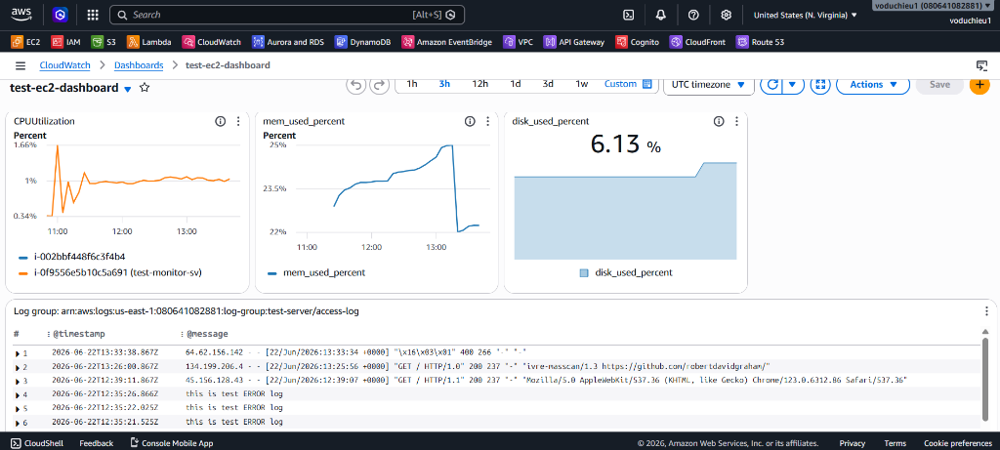

# 10. CloudWatch Dashboard (Màn hình giám sát CloudWatch)

Amazon CloudWatch Dashboards cung cấp một màn hình giám sát tập trung (Single Pane of Glass), cho phép bạn trực quan hóa các số liệu đo lường (Metrics) và nhật ký (Logs) của toàn bộ tài nguyên hệ thống theo thời gian thực.

---

## I. Các tính năng nổi bật của CloudWatch Dashboard

### 1. Giám sát đa tài khoản và đa vùng (Cross-Account & Cross-Region)
Một trong những điểm mạnh nhất của CloudWatch Dashboard là khả năng tổng hợp dữ liệu từ nhiều dịch vụ khác nhau chạy trên **nhiều Vùng (Regions)** của AWS và trên **nhiều tài khoản AWS khác nhau** (thông qua tích hợp với AWS Organizations) lên một giao diện duy nhất. Bạn không cần phải chuyển đổi vùng hay đăng nhập/đăng xuất giữa các tài khoản để theo dõi hệ thống phân tán toàn cầu.

### 2. Khả năng tùy biến giao diện cao
Giao diện Dashboard hoạt động theo cơ chế kéo thả trực quan:
* **Customize Size & Position:** Tự do kéo dãn, thay đổi kích thước và vị trí của các biểu đồ để phù hợp với màn hình giám sát của đội ngũ vận hành.
* **Thời gian hiển thị (Time Range):** Dễ dàng điều chỉnh khung thời gian xem dữ liệu từ 1 giờ, 3 giờ, 1 ngày, 1 tuần hoặc cấu hình tùy chỉnh (Custom Time Range).
* **Tự động làm mới (Auto-Refresh):** Cấu hình tự động cập nhật dữ liệu mới sau mỗi 10 giây, 1 phút, 5 phút,...

---

## II. Các loại Widget hỗ trợ trên Dashboard

Dashboard cho phép bạn thêm nhiều biểu đồ (widgets) với nhiều hình dạng và mục đích biểu diễn khác nhau:

* **Biểu đồ đường / Biểu đồ vùng (Line / Stacked Area):** Thích hợp biểu diễn xu hướng biến động của dữ liệu theo thời gian (ví dụ: CPU Utilization %, Network traffic, RAM usage).
* **Chỉ số số lớn (Number Metric):** Hiển thị giá trị số hiện tại của một chỉ số duy nhất dạng chữ lớn để đập ngay vào mắt người xem (ví dụ: số lượng concurrent executions hiện tại của Lambda, tổng số lỗi 5xx trong 5 phút qua).
* **Trạng thái Alarm (Alarm Status):** Hiển thị danh sách và trạng thái hiện tại của các Alarms (`OK`, `ALARM`, `INSUFFICIENT_DATA`), giúp nhanh chóng xác định tài nguyên nào đang gặp sự cố.
* **Bảng dữ liệu Log (Log Table / Logs Insights):** Nhúng trực tiếp kết quả truy vấn logs thời gian thực từ CloudWatch Logs Insights lên dashboard để theo dõi các lỗi ứng dụng mới phát sinh.
* **Text Widget (Markdown):** Hỗ trợ viết tài liệu hướng dẫn vận hành, quy trình xử lý sự cố (Runbooks/Playbooks) hoặc ghi chú kỹ thuật bằng cú pháp Markdown ngay cạnh các biểu đồ hiệu năng.

---

## III. Minh họa giao diện CloudWatch Dashboard thực tế

Dưới đây là một ví dụ về một CloudWatch Dashboard được thiết lập để giám sát một ứng dụng serverless, tích hợp các widget biểu đồ Invocations, Response rate, Latency, Concurrency và Log events:

  

