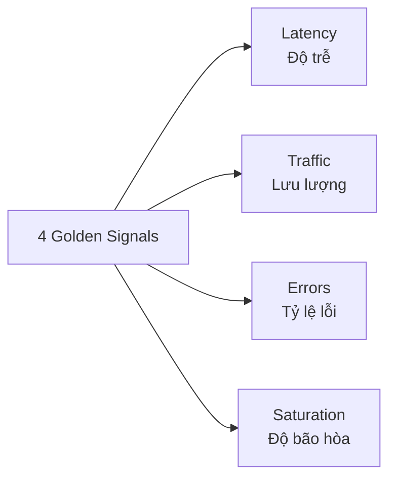

# 11. Designing Monitor Considerations (Khi thiết kế hệ thống giám sát cần quan tâm những gì?)

Thiết kế một hệ thống giám sát hiệu quả đòi hỏi sự cân bằng giữa khả năng phát hiện lỗi nhanh chóng, chi phí vận hành và tính thực tiễn của các cảnh báo. Dưới đây là bộ câu hỏi và trả lời chi tiết giúp định hình chiến lược giám sát toàn diện cho hệ thống.

---

## I. Bộ câu hỏi thiết kế hệ thống giám sát (Monitoring Considerations Q&A)

### 1. Hệ thống có những tài nguyên (Resources) nào cần giám sát?
Hạ tầng hệ thống được chia làm 5 lớp cốt lõi cần bao phủ:
* **Lớp tính toán (Compute Layer):** Các máy chủ EC2 instances, ECS Tasks/Containers, AWS Lambda functions.
* **Lớp cơ sở dữ liệu (Database Layer):** Relational Database (RDS MySQL/Postgres), NoSQL Database (DynamoDB).
* **Lớp mạng & Phân phối (Network & CDN Layer):** Application Load Balancers (ALB), Route 53 DNS, CloudFront CDN.
* **Lớp lưu trữ (Storage Layer):** Amazon S3 Buckets, EFS (Elastic File System).
* **Lớp hàng đợi / Luồng dữ liệu (Message/Queue Layer):** Amazon SQS, SNS, Kinesis Data Streams.

### 2. Với mỗi tài nguyên, cần giám sát những thông số (Metrics) nào?
Mỗi loại tài nguyên có các chỉ số đặc thù phản ánh trực tiếp sức khỏe vận hành:
* **EC2 Instance:** CPU Utilization, Disk Read/Write (Ops/Bytes), Network In/Out.
  * *Custom Metrics (yêu cầu Agent):* Memory (RAM) Utilization %, Disk Space Space Remaining %.
* **AWS Lambda:** Invocations (Số lần gọi), Errors (Số lần lỗi), Duration (Thời gian chạy), Throttles (Số lần bị giới hạn tải), Concurrent Executions (Số thực thi đồng thời).
* **Amazon RDS:** CPU Utilization, Free Storage Space (Dung lượng đĩa trống), Database Connections (Số kết nối đồng thời), Read/Write Latency (Độ trễ truy vấn), Replica Lag (Độ trễ đồng bộ Read Replica).
* **Amazon ALB:** Request Count (Số request), Target Response Time (Thời gian phản hồi của backend), HTTP 5xx / 4xx error rate (Tỷ lệ lỗi server/client), Active Connection Count.
* **Amazon S3:** BucketSizeBytes (Dung lượng), NumberOfObjects (Số lượng file).

### 3. Những thông số nào cần đặt cảnh báo (Alarms)? Thông số nào cần trực quan hóa (Dashboards)?
* **Các chỉ số cần thiết lập Alarm (Cảnh báo khi đạt ngưỡng nguy hiểm):**
  * `CPU Utilization > 80%` liên tục trong 15 phút.
  * `Memory Utilization > 85%` (RAM quá tải có thể làm chết ứng dụng).
  * `Free Storage Space < 10%` (Hết dung lượng đĩa sẽ gây sập database).
  * `Lambda Errors > 0` (Báo động ngay khi hàm Lambda gặp lỗi runtime Exception).
  * `Target Response Time > 2.0s` (Hệ thống đang phản hồi quá chậm tới người dùng).
  * `HTTP 5xx error rate > 5%` (Ứng dụng web đang trả về lỗi hệ thống).
* **Các chỉ số cần đưa lên Dashboard (Quan sát xu hướng và lập kế hoạch tài nguyên):**
  * Tổng lưu lượng Network In/Out hàng ngày.
  * Số lượng HTTP Request theo thời gian thực (để vẽ biểu đồ đỉnh tải).
  * Cache Hit Rate của CloudFront để đánh giá hiệu quả tối ưu CDN.
  * Tần suất Invocations của Lambda để theo dõi quy mô hệ thống.

### 4. Những tài nguyên nào cần thu thập nhật ký (Collect Logs)?
* **Web Server & Ứng dụng:** Logs truy cập và logs lỗi của ứng dụng chạy trên EC2 (Nginx, Apache, Node.js, Spring Boot...).
* **Serverless Services:** logs tự động của AWS Lambda, API Gateway Access Logs.
* **Network & Security:** VPC Flow Logs (lưu vết traffic mạng ra vào VPC), ALB Access Logs (ghi lại mọi request HTTP gửi lên load balancer).
* **Database:** RDS Slow Query Logs (nhật ký các câu lệnh SQL chạy chậm).
* **Compliance & Auditing:** AWS CloudTrail Logs (lưu lại mọi cuộc gọi API thay đổi tài nguyên trên tài khoản AWS).

### 5. Với mỗi tài nguyên có log, cần thu thập những loại logs cụ thể nào?
* **EC2 Web Server:** Access logs (để phân tích traffic, địa chỉ IP client, HTTP method) và Error logs (để debug lỗi code).
* **Hệ điều hành EC2 (Linux):** `/var/log/secure` hoặc `/var/log/auth.log` (Lịch sử đăng nhập SSH để giám sát bảo mật), `/var/log/messages` hoặc `/var/log/syslog` (Các sự kiện nhân hệ điều hành).
* **RDS Database:** Slow Query Logs (Các truy vấn chạy lâu hơn 1 hoặc 2 giây) để kỹ sư tối ưu hóa SQL indexes.
* **Lambda:** Toàn bộ dữ liệu logs ghi ra standard output/error (`console.log`, exceptions, dump traces).

### 6. Có thiết lập Alarm cho Logs không?
* **Có:** Áp dụng **Log Metrics Filter** để chuyển đổi dữ liệu dạng text trong logs thành metrics dạng số.
* **Cấu hình cụ thể:** Quét các từ khóa nhạy cảm trong log như `ERROR`, `FATAL`, `Access Denied`, `Exception`, `Timeout`. Nếu số lượng xuất hiện vượt quá 5 lần trong vòng 5 phút, hệ thống sẽ tự động kích hoạt Alarm báo động cho đội ngũ DevOps.

### 7. Metrics và Logs nên được lưu trữ ở đâu? (Dịch vụ nguyên bản hay tự dựng?)
* **Dịch vụ nguyên bản AWS (CloudWatch Logs & Metrics - Native):**
  * *Ưu điểm:* Tích hợp cực kỳ sâu sắc với mọi tài nguyên AWS, tự động co giãn lưu trữ (Serverless), bảo mật cao qua IAM, không mất công cài đặt, vận hành.
  * *Nhược điểm:* Chi phí lưu trữ logs và chi phí truy vấn (Logs Insights) tương đối đắt đỏ ở quy mô lớn.
* **Tự dựng / Dịch vụ bên thứ ba (Grafana, Prometheus, OpenSearch, Datadog):**
  * *Áp dụng khi:* Doanh nghiệp chạy mô hình Multi-Cloud (nhiều đám mây) hoặc Hybrid-Cloud.
  * *Giải pháp:* Stream logs từ CloudWatch qua S3 hoặc Kinesis, sau đó đẩy về **Prometheus & Grafana** (đối với Metrics) và **Elasticsearch/OpenSearch** (đối với Logs) để tối ưu chi phí lưu trữ lâu dài và có giao diện trực quan đẹp mắt hơn.

### 8. Khi có Alarm kích hoạt, cần gửi thông báo tới ai?
Thiết lập 3 cấp độ cảnh báo (Severity Levels) để phân phối đúng đối tượng:
* **Cấp độ 1 (Critical - P1):** Gây sập hệ thống (ví dụ: Disk đầy, Database sập). Kích hoạt cảnh báo qua Amazon SNS kết hợp công cụ On-Call (PagerDuty, Opsgenie) để tự động gọi điện thoại, nhắn tin SMS bắt buộc đội ngũ trực vận hành (SRE/Ops Team) phải thức dậy xử lý tức thời 24/7.
* **Cấp độ 2 (Warning - P2):** Hệ thống quá tải hoặc phát sinh lỗi nhẹ (ví dụ: CPU > 85%, RAM tăng cao). Gửi thông báo tự động vào kênh chat chung (Slack/Teams/Telegram) của đội phát triển (Developer Team) để theo dõi và tối ưu hóa trong giờ làm việc.
* **Cấp độ 3 (Informational - P3):** Báo cáo hiệu năng hàng ngày/hàng tuần. Gửi email tóm tắt cho Project Manager và Product Owner để phục vụ việc lên kế hoạch bảo trì.

### 9. Các yêu cầu khác liên quan đến quy trình vận hành hệ thống giám sát
* **Runbook tích hợp:** Mỗi email hoặc tin nhắn cảnh báo gửi đi bắt buộc phải kèm theo link tài liệu hướng dẫn xử lý (Runbook/Playbook) tương ứng cho lỗi đó để kỹ sư có thể thao tác khắc phục nhanh nhất.
* **Kiểm soát nhiễu cảnh báo (Alert Fatigue):** Định kỳ hàng tuần phải review lại danh sách Alarms, loại bỏ các Alarm rác, điều chỉnh lại ngưỡng (Threshold) nếu nhận thấy cảnh báo quá nhạy.
* **Tự động hóa khắc phục (Auto-healing):** Ưu tiên cấu hình Alarm kích hoạt script tự động sửa lỗi trước khi gửi tin nhắn cho con người. Ví dụ: Tự động chạy Lambda script xóa file logs cũ hoặc giải phóng cache khi ổ đĩa báo động đầy > 90%.
* **Retention Policy bắt buộc:** Thiết lập Log Retention cho từng Log Group (ví dụ: 7 ngày đối với Dev, 90 ngày đối với Prod) thay vì để mặc định *Never expire*, tránh hóa đơn AWS tăng đột biến.

---

## II. Nguyên tắc vàng khi thiết kế Giám sát (Golden Signals)

Khi thiết kế dashboard và alarms, hãy bám sát 4 tín hiệu vàng của giám sát hệ thống phân tán:

1. **Latency (Độ trễ):** Thời gian cần thiết để xử lý một request (ví dụ: trung bình 150ms, chặng chậm nhất p99 là 2s).
2. **Traffic (Lưu lượng tải):** Mức độ đáp ứng của dịch vụ (ví dụ: số lượng HTTP request/second, số lượng transaction database/second).
3. **Errors (Tỷ lệ lỗi):** Tỷ lệ các request bị thất bại (ví dụ: số lượng lỗi HTTP 500, số lượng lỗi truy vấn DB).
4. **Saturation (Độ bão hòa/Đầy):** Mức độ sử dụng tài nguyên của hệ thống, chỉ ra phần cứng sắp chạm ngưỡng giới hạn (ví dụ: dung lượng RAM còn lại, % CPU sử dụng).
