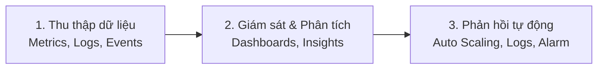

# 2. What is CloudWatch (Amazon CloudWatch là gì?)

**Amazon CloudWatch** là dịch vụ giám sát (monitoring) và quản lý (management) được AWS cung cấp để theo dõi các tài nguyên AWS và các ứng dụng bạn chạy trên AWS theo thời gian thực.

---

## I. Nguyên lý hoạt động của CloudWatch

Amazon CloudWatch hoạt động dựa trên cơ chế thu thập dữ liệu tự động từ các dịch vụ AWS và ứng dụng, sau đó phân tích và đưa ra phản hồi:

1. **Thu thập (Collect):** CloudWatch thu thập các số liệu hiệu năng (Metrics) và nhật ký hoạt động (Logs) từ hơn 70 dịch vụ AWS tích hợp sẵn, hoặc từ hệ điều hành và mã nguồn ứng dụng thông qua CloudWatch Agent.
2. **Giám sát (Monitor):** Hiển thị dữ liệu trực quan bằng biểu đồ trên **CloudWatch Dashboards** và phân tích chuyên sâu log bằng **Logs Insights**.
3. **Phản hồi (Act):** Thiết lập các cảnh báo **CloudWatch Alarms** để tự động gửi thông báo (qua SNS), kích hoạt co giãn tự động (Auto Scaling) hoặc chạy các tập lệnh phục hồi tự động.

---

## II. Lợi ích khi sử dụng Amazon CloudWatch

* **Tích hợp Native sâu sắc:** Tự động thu thập dữ liệu từ hầu hết dịch vụ AWS (như EC2, RDS, DynamoDB, Lambda, ECS,...) ngay khi tài nguyên được khởi tạo mà không cần cài đặt thêm phần mềm bên ngoài.
* **Tự động hóa phản hồi:** Kết hợp linh hoạt với Auto Scaling và AWS Lambda để xây dựng hệ thống tự phục hồi (self-healing architecture).
* **Khả năng quan sát tập trung (Single Pane of Glass):** Gom toàn bộ chỉ số hiệu năng và log của toàn hệ thống về một giao diện quản lý duy nhất.
* **Bảo mật và Phân quyền:** Tích hợp trực tiếp với IAM để đảm bảo chỉ những kỹ sư được cấp quyền mới có thể xem số liệu hoặc cấu hình cảnh báo.
