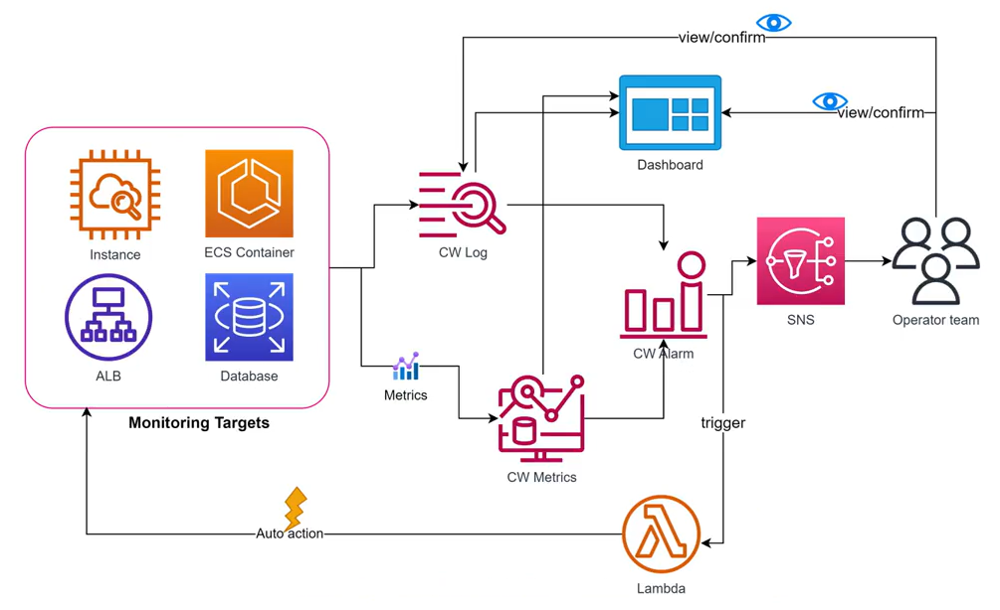

# 3. CloudWatch Features (Các tính năng của CloudWatch)

Amazon CloudWatch cung cấp một bộ tính năng mạnh mẽ phục vụ cho nhu cầu giám sát toàn diện từ cơ sở hạ tầng (infrastructure) cho đến ứng dụng (application):

---

## I. Luồng quan sát tổng quát (Observability Flow)

Amazon CloudWatch giúp bạn đạt được khả năng quan sát toàn diện (Observability) xuyên suốt các lớp hạ tầng và ứng dụng thông qua luồng xử lý khép kín:

  

* **Collect (Thu thập):** Thu thập Metrics và Logs từ tài nguyên (resource), ứng dụng (application) và các dịch vụ chạy trên AWS hoặc máy chủ on-premises vật lý.
* **Monitor (Giám sát):** Trực quan hóa các ứng dụng và cơ sở hạ tầng với dashboards, dò tìm và phát hiện lỗi kết hợp tương quan logs và metrics, đồng thời thiết lập cảnh báo.
* **Act (Phản hồi tự động):** Tự động hóa các phản hồi trước các thay đổi hoặc sự cố vận hành thông qua Amazon CloudWatch Events (EventBridge) và Auto Scaling.
* **Analyze (Phân tích):** Phân tích thời gian thực với độ chi tiết metrics lên tới 1 giây, kéo dài thời gian lưu trữ dữ liệu (lên tới 15 tháng), và phân tích thời gian thực bằng các công thức toán học tính toán trên metrics (metric math).

Nhờ đó, CloudWatch mang lại 5 giá trị cốt lõi:
1. Giám sát ứng dụng (Application monitoring).
2. Tầm nhìn bao quát toàn bộ hệ thống (System-wide visibility).
3. Tối ưu hóa tài nguyên (Resource optimization).
4. Sức khỏe vận hành thống nhất (Unified operational health).
5. Khả năng quan sát hợp nhất trên nhiều tài khoản (Unified cross-account observability).

---

## II. Sơ đồ kiến trúc thu thập và xử lý (Architecture & Workflow)

Sơ đồ dưới đây mô tả chi tiết đường đi của dữ liệu từ các mục tiêu giám sát (Monitoring Targets) qua các bộ lọc, lưu trữ cho tới các hành động cảnh báo và xử lý tự động:

  

1. **Monitoring Targets (Đối tượng giám sát):** Bao gồm EC2 Instance, ECS Container, Application Load Balancer (ALB), các Database (RDS/DynamoDB),...
2. **Thu thập dữ liệu (CW Log & Metrics):** 
   * Dữ liệu dạng text (Application Log, System Log) được đẩy về **CloudWatch Logs** để lưu trữ và truy vấn.
   * Dữ liệu dạng chỉ số (CPU, RAM, Connections) được thu thập và lưu trữ dưới dạng **CloudWatch Metrics**.
3. **Màn hình trực quan (Dashboard):** Người vận hành (Operator team) có thể xem và xác nhận (view/confirm) trạng thái hệ thống trực quan thông qua Dashboards kết nối với cả Logs và Metrics.
4. **Báo động & Cảnh báo (CW Alarm & SNS):** 
   * Bộ lọc **CloudWatch Alarms** giám sát liên tục các metrics.
   * Khi metrics vượt ngưỡng, Alarm được kích hoạt (trigger) gửi tin nhắn qua dịch vụ **Amazon SNS** để thông báo trực tiếp cho Operator team.
5. **Xử lý tự động (Auto Action):** 
   * Alarms có thể kích hoạt các hàm **AWS Lambda** để thực thi các hành động khắc phục sự cố tự động (Auto action) trực tiếp lên các Monitoring Targets (ví dụ: khởi động lại service, giải phóng dung lượng đĩa).

---

## III. Các nhóm tính năng chính của CloudWatch

### 1. Nhóm tính năng Thu thập và Lưu trữ dữ liệu
* **Giám sát tự động (Automatic Monitoring):** Các dịch vụ AWS tự động đẩy các chỉ số cơ bản về CloudWatch với tần suất mặc định (5 phút đối với EC2 cơ bản hoặc 1 phút nếu bật Detailed Monitoring).
* **Thu thập Log tập trung (Centralized Logging):** Lưu trữ nhật ký hoạt động từ ứng dụng Web (Nginx, Apache), cơ sở dữ liệu (slow queries), log hệ thống Linux (`/var/log/messages`) hay Windows Event Logs.

### 2. Nhóm tính năng Phân tích và Trực quan hóa
* **Phân tích truy vấn log nhanh chóng (Logs Insights):** Cung cấp giao diện truy vấn mạnh mẽ với ngôn ngữ viết code riêng (tương tự SQL) giúp tìm kiếm, lọc và phân tích hàng triệu dòng log chỉ trong vài giây.
* **Trực quan hóa biểu đồ (Custom Dashboards):** Tạo các dashboard hiển thị biểu đồ thời gian thực, kết hợp chỉ số của nhiều dịch vụ AWS khác nhau trên cùng một màn hình điều khiển.

### 3. Nhóm tính năng Cảnh báo và Phản hồi tự động
* **Báo động thông minh (Alarms):** Kích hoạt cảnh báo khi số liệu vượt ngưỡng thiết lập (Threshold). Hỗ trợ cả **Anomaly Detection** (Phát hiện bất thường) tự động học hành vi của metrics để phát hiện đột biến.
* **Cảnh báo đa kênh:** Tích hợp với **Amazon SNS** để gửi thông báo qua Email, SMS, Slack, Microsoft Teams, PagerDuty... hoặc kích hoạt AWS Lambda để sửa lỗi tự động.

### 4. Nhóm tính năng Theo dõi Trải nghiệm người dùng (Advanced)
* **CloudWatch Synthetics:** Tạo ra các con bot giả lập hành vi người dùng (Canaries) chạy định kỳ 24/7 để kiểm tra tính khả dụng của trang web, API endpoint và cảnh báo nếu trang web bị lỗi hoặc phản hồi chậm.
* **CloudWatch RUM (Real User Monitoring):** Thu thập dữ liệu hiệu năng ứng dụng khách (client-side) trực tiếp từ trình duyệt của người dùng thực tế để đo lường thời gian tải trang, lỗi Javascript và trải nghiệm mạng.
