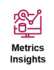
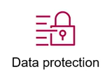
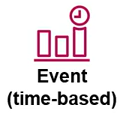
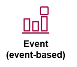
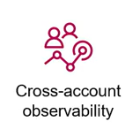
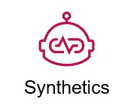

# 4. CloudWatch Core Components (Các thành phần cơ bản của CloudWatch)

Để làm chủ CloudWatch, bạn cần hiểu rõ các thành phần cốt lõi tạo nên hệ thống này:

---

## I. CloudWatch Metrics (Số liệu đo lường)

**Metric** là dữ liệu đo lường hiệu năng dạng chuỗi thời gian (time-series data) về trạng thái hệ thống. 
* **Namespace (Không gian tên):** Vùng chứa các metrics của một dịch vụ cụ thể. Ví dụ: `AWS/EC2` chứa metrics của máy chủ EC2, `AWS/RDS` chứa metrics của RDS.
* **Dimension (Chiều dữ liệu):** Cặp key-value dùng để định danh duy nhất cho một metric. Ví dụ: `InstanceId=i-1234567890abcdef0`.
* **Tần suất (Resolution):**
  * **Standard Resolution (Mặc định):** Thu thập dữ liệu mỗi 1 phút hoặc 5 phút.
  * **High Resolution:** Thu thập chi tiết đến **1 giây** (phù hợp cho các metrics cực kỳ quan trọng cần phát hiện đột biến ngay lập tức).
* **Custom Metrics:** Chỉ số do người dùng tự định nghĩa và gửi lên bằng AWS CLI, SDK hoặc CloudWatch Agent (ví dụ: RAM utilization, Disk space).

### CloudWatch Metrics Insights:


Công cụ phân tích hiệu năng cao, dựa trên SQL, cho phép bạn truy vấn các metrics trên quy mô lớn theo thời gian thực.
* Giúp bạn nhanh chóng xác định các xu hướng, tìm kiếm các tài nguyên có hiệu năng bất thường (ví dụ: lọc ra 10 EC2 có tải CPU cao nhất trong hàng ngàn máy chủ) bằng cú pháp SQL đơn giản.

<br clear="right"/>

---

## II. CloudWatch Alarm (Báo động)


**Alarm** theo dõi một metric duy nhất (hoặc kết quả tính toán toán học từ nhiều metrics) trong một khoảng thời gian xác định và thực hiện một hoặc nhiều hành động tự động.
* **Các trạng thái của Alarm:**
  * **`OK`:** Chỉ số đo lường nằm trong ngưỡng an toàn bình thường.
  * **`ALARM`:** Chỉ số đã vượt quá ngưỡng thiết lập (ví dụ: CPU > 80% liên tục trong 3 chu kỳ).
  * **`INSUFFICIENT_DATA`:** Không có đủ dữ liệu để xác định trạng thái (ví dụ: instance bị tắt hoặc lỗi kết nối mạng).
* **Hành động phản hồi (Actions):** Gửi mail cảnh báo qua **Amazon SNS**, kích hoạt **Auto Scaling Policy** (để scale out thêm EC2) hoặc thực hiện hành động trên EC2 (như Stop, Terminate, Reboot instance).

<br clear="right"/>

---

## III. CloudWatch Logs (Nhật ký sự kiện)


**CloudWatch Logs** cho phép bạn tập trung hóa, lưu trữ và theo dõi log từ các nguồn khác nhau.
* **Log Event:** Một dòng nhật ký chứa mốc thời gian (timestamp) và thông điệp thô (raw message).
* **Log Stream:** Chuỗi các log event đến từ cùng một nguồn cụ thể (ví dụ log của một instance EC2 cụ thể hoặc một container task).
* **Log Group:** Tập hợp các Log Stream chia sẻ chung cấu hình về chính sách lưu trữ (Retention Policy) và phân quyền truy cập (IAM). Ví dụ: Log Group `/var/log/httpd` gom tất cả stream truy cập của các web server.
* **Retention Policy:** Thiết lập thời gian lưu trữ logs trước khi tự động xóa (từ 1 ngày đến không bao giờ xóa).
* **Data Protection (Bảo vệ dữ liệu nhạy cảm):**  Tính năng giúp tự động phát hiện, báo cáo và che giấu (masking) các thông tin nhạy cảm của người dùng cuối (như số thẻ tín dụng, số điện thoại, email, định danh cá nhân) ghi trong logs của bạn để đảm bảo tuân thủ bảo mật dữ liệu.

<br clear="right"/>

---

## IV. CloudWatch Logs Insights (Phân tích Logs)

Công cụ phân tích tương tác giúp truy vấn dữ liệu Logs bằng ngôn ngữ truy vấn mạnh mẽ:
* Cho phép tìm kiếm cụm từ lỗi, đếm số lượng lỗi theo thời gian, lọc IP truy cập nhiều nhất.
* Cú pháp ví dụ để lọc 20 lỗi gần nhất:
  ```sql
  fields @timestamp, @message
  | filter @message like /ERROR/
  | sort @timestamp desc
  | limit 20
  ```

---

## V. CloudWatch Dashboards (Màn hình giám sát)

Trang hiển thị trực quan hóa dữ liệu giúp theo dõi nhanh hiệu năng toàn cục:
* Hỗ trợ nhiều dạng widget: đồ thị đường (Line chart), đồ thị cột (Stacked area), chỉ số số lớn (Number metric), trạng thái Alarms.
* Có thể kéo thả, phóng to thu nhỏ và chia sẻ an toàn cho các thành viên trong nhóm.

---

## VI. AWS X-Ray (Giám sát dấu vết cuộc gọi - Tracing)

Mặc dù là một dịch vụ độc lập, X-Ray tích hợp chặt chẽ với CloudWatch để cung cấp khả năng **Distributed Tracing**:
* Giúp lập bản đồ cuộc gọi (Service Map) chỉ rõ đường đi của một request qua các API Gateway, Lambda, ECS, RDS.
* Giúp nhanh chóng phát hiện ra microservice nào đang bị nghẽn cổ chai hoặc phát sinh lỗi HTTP 5xx.

---

## VII. CloudWatch Rules / Events (Amazon EventBridge)


**CloudWatch Rules** (hiện tại đã phát triển thành **Amazon EventBridge**) giúp theo dõi các sự kiện thay đổi trạng thái của tài nguyên AWS theo thời gian thực.
* Cho phép định nghĩa các quy tắc (Rules) tự động so khớp các sự kiện và chuyển tiếp chúng đến các target xử lý như AWS Lambda, SNS, SQS để tự động hóa quy trình vận hành.

### Các loại trigger chính trong EventBridge:
* **Event (time-based):**  Kích hoạt hành động theo thời gian định kỳ (Schedule/Cron expression). Ví dụ: Chạy Lambda dọn dẹp ổ đĩa mỗi 24 giờ.
* **Event (event-based):**  Kích hoạt hành động phản ứng trước sự thay đổi trạng thái của các tài nguyên AWS. Ví dụ: Phát hiện có người tắt EC2 thì gửi ngay thông báo.

<br clear="right"/>

---

## VIII. CloudWatch RUM (Real User Monitoring)


**CloudWatch RUM** thu thập dữ liệu về hiệu năng ứng dụng khách (client-side) trực tiếp từ những người dùng thực tế đang tương tác với ứng dụng web của bạn trên trình duyệt.
* Giúp theo dõi thời gian tải trang (page load time), lỗi JavaScript, các lỗi HTTP client-side và thông tin về thiết bị/trình duyệt của người dùng để cải thiện trải nghiệm khách hàng.

<br clear="right"/>

---

## IX. Cross-Account Observability (Giám sát đa tài khoản)



Tính năng **Cross-Account Observability** cho phép bạn tìm kiếm, trực quan hóa và phân tích số liệu (metrics), nhật ký (logs) và dấu vết (traces) một cách liền mạch trên nhiều tài khoản AWS khác nhau thuộc cùng một AWS Organization.
* Giúp đội ngũ vận hành có cái nhìn toàn cảnh về hệ thống phân tán phức tạp trải rộng trên hàng chục tài khoản AWS mà không cần phải đăng nhập - đăng xuất liên tục giữa các tài khoản.

<br clear="right"/>

---

## X. CloudWatch Evidently (Thử nghiệm & Đánh giá tính năng)


**CloudWatch Evidently** là dịch vụ hỗ trợ các nhà phát triển ứng dụng thực hiện các thử nghiệm A/B Testing và quản lý triển khai tính năng mới (Feature Flags).
* Cho phép bạn thử nghiệm đưa tính năng mới tới một nhóm nhỏ người dùng thực tế, đo lường tác động đối với các chỉ số kinh doanh hoặc kỹ thuật (như thời gian phản hồi) trước khi chính thức phát hành rộng rãi cho toàn bộ người dùng.

<br clear="right"/>

---

## XI. CloudWatch Synthetics (Giám sát chủ động - Synthetic Monitoring)



**CloudWatch Synthetics** cho phép bạn giám sát các endpoint và API một cách chủ động thông qua việc tạo ra các Canaries (các con bot kịch bản giả lập hành vi người dùng) chạy liên tục 24/7.
* Giúp bạn phát hiện ngay các sự cố sập trang web, lỗi API, thời gian tải trang bị chậm trễ hoặc liên kết bị hỏng (broken links) trước khi người dùng thực tế phát hiện ra.

<br clear="right"/>
