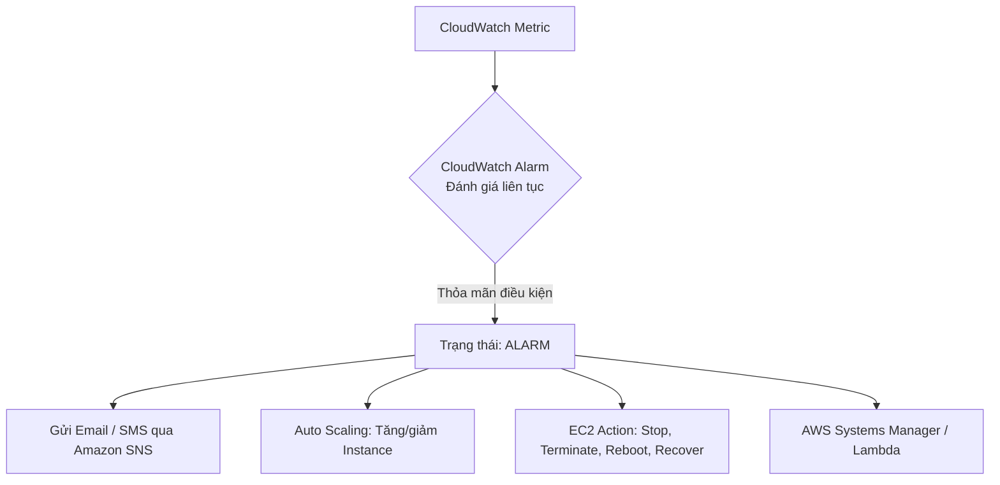
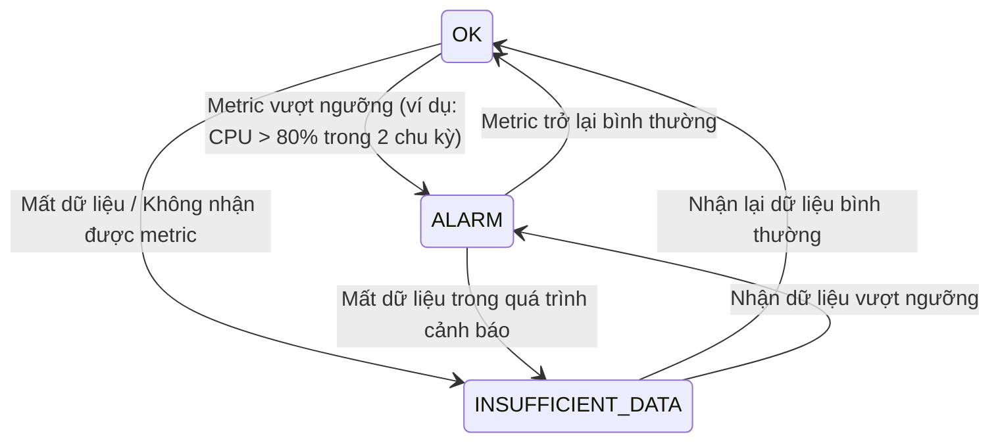

# 6. CloudWatch Alarm (Cảnh báo CloudWatch)

CloudWatch Alarm cho phép bạn tạo ra các cảnh báo tự động dựa trên các chỉ số đo lường (Metrics). Hệ thống sẽ liên tục giám sát các Metrics và kích hoạt hành động phản hồi thích hợp ngay khi giá trị đạt hoặc vượt quá ngưỡng cấu hình xác định.

  

---

## I. Nguyên lý hoạt động của CloudWatch Alarm

CloudWatch Alarm hoạt động theo cơ chế đánh giá liên tục (evaluation) dữ liệu metrics theo chu kỳ (Period) và số lượng chu kỳ (Evaluation Periods).

### 1. Ba trạng thái cốt lõi của Alarm
* **`OK`:** Chỉ số đo lường hoạt động bình thường, nằm trong ngưỡng an toàn thiết lập.
* **`ALARM`:** Chỉ số đo lường vượt ngưỡng hoặc thỏa mãn điều kiện cảnh báo (ví dụ: CPU Utilization > 80% liên tiếp trong 3 chu kỳ).
* **`INSUFFICIENT_DATA`:** Không có đủ dữ liệu để đánh giá trạng thái. Thường xảy ra khi tài nguyên mới khởi tạo, bị tắt đi, hoặc gặp sự cố ngắt kết nối mạng không gửi được metric về.

---

## II. Các điều kiện kích hoạt Alarm

Bạn có thể thiết lập cảnh báo dựa trên nhiều loại điều kiện và thuật toán tính toán đa dạng:
* **Ngưỡng cố định (Static Threshold):** So sánh giá trị Metric với một số cố định.
  * **Vượt quá ngưỡng:** Lớn hơn (`>`) hoặc lớn hơn hoặc bằng (`>=`).
  * **Thấp hơn ngưỡng:** Nhỏ hơn (`<`) hoặc nhỏ hơn hoặc bằng (`<=`).
* **Các chỉ số thống kê (Statistics):** Áp dụng trên Metric trong mỗi chu kỳ (Period) như:
  * **Average (Trung bình):** Giá trị trung bình của metric.
  * **Sum (Tổng hợp):** Tổng giá trị thu thập (ví dụ: Tổng số lượng lỗi).
  * **Minimum / Maximum:** Giá trị nhỏ nhất hoặc lớn nhất.
  * **Sample Count:** Số lượng mẫu dữ liệu gửi về.
* **Metric Math (Tính toán nâng cao):** Cảnh báo dựa trên kết quả tính toán từ nhiều metrics khác nhau.
* **Dò tìm bất thường (Anomaly Detection):** CloudWatch sử dụng học máy (Machine Learning) để tự động phân tích dữ liệu lịch sử của metric, tạo ra một dải giá trị dự đoán bình thường (expected band). Cảnh báo sẽ kích hoạt nếu giá trị metric thực tế vượt ra ngoài dải dự đoán này.

---

## III. Các hành động phản hồi khi Alarm kích hoạt

Khi trạng thái của Alarm thay đổi (phổ biến nhất là từ `OK` sang `ALARM`), bạn có thể cấu hình tự động kích hoạt một hoặc nhiều hành động sau:

### 1. Gửi thông báo (Notifications)
* **Amazon SNS (Simple Notification Service):** Gửi email cảnh báo trực tiếp đến quản trị viên, hoặc gửi tin nhắn văn bản SMS (khi kết hợp SNS với nhà mạng viễn thông).
* **Amazon SES (Simple Email Service):** Cấu hình thông qua Lambda để gửi email có định dạng tùy biến cao.
* **Tích hợp ChatOps:** Chuyển tiếp thông báo từ SNS qua Slack, Microsoft Teams hoặc Telegram để đội ngũ vận hành cập nhật tức thời.

### 2. Hành động trên tài nguyên EC2 (EC2 Actions)
CloudWatch Alarm tích hợp trực tiếp với EC2 để tự động hóa các thao tác hạ tầng vật lý:
* **Stop / Terminate:** Tắt hoặc xóa máy chủ khi phát hiện nó không còn hoạt động hoặc chạy xong tác vụ để tiết kiệm chi phí.
* **Reboot:** Khởi động lại máy chủ nếu phát hiện hệ điều hành bị treo (ví dụ: mất kết nối SSH, ping không phản hồi).
* **Recover (Khôi phục):** Tự động chuyển instance EC2 sang một phần cứng vật lý mới của AWS nếu phát hiện phần cứng hiện tại gặp sự cố vật lý, giữ nguyên IP, Volume và cấu hình.

### 3. Co giãn tự động (Auto Scaling Actions)
Kích hoạt chính sách co giãn (**Auto Scaling Policy**):
* Tự động tăng số lượng instance (Scale Out) khi tải tăng cao (ví dụ: CPU > 75%) để gánh tải cho hệ thống.
* Tự động giảm số lượng instance (Scale In) khi tải giảm (ví dụ: CPU < 30%) để tối ưu hóa chi phí vận hành.

### 4. Tự động hóa quy trình vận hành phức tạp
* **AWS Systems Manager (SSM) / Lambda / EventBridge:** Kích hoạt chạy một đoạn script tự động sửa lỗi (ví dụ: giải phóng bộ nhớ đệm, tự động mở rộng storage khi ổ đĩa đầy).
