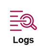
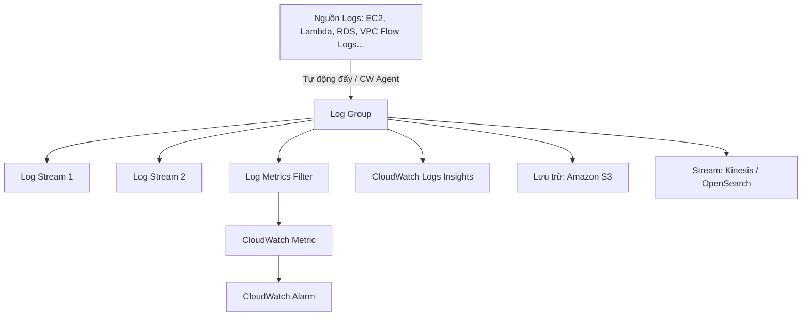

# 7. CloudWatch Logs (Nhật ký sự kiện CloudWatch)

CloudWatch Logs là dịch vụ cho phép bạn tập trung hóa, lưu trữ, giám sát và phân tích nhật ký hoạt động (logs) từ các hệ điều hành, ứng dụng và dịch vụ AWS trong cả môi trường đám mây lẫn on-premise vật lý.

<p align="center">
  
</p>

---

## I. Tổng quan và các thao tác hỗ trợ

Nhiều dịch vụ cốt lõi của AWS (như AWS Lambda, Amazon RDS slow query log, VPC Flow Logs, API Gateway access logs...) có tùy chọn tích hợp sẵn cho phép export thẳng dữ liệu logs ra CloudWatch Logs chỉ bằng cách kích hoạt cấu hình đơn giản.



### CloudWatch Logs hỗ trợ 4 nhóm thao tác chính:
1. **Xem logs theo thời gian thực (Live Tail / Real-time Logs):** Xem trực tiếp các luồng logs đang phát sinh trên hệ thống thông qua giao diện CloudWatch Console hoặc sử dụng API/SDK/CLI để truy xuất.
2. **Lọc và Tìm kiếm logs:** Cung cấp công cụ lọc mạnh mẽ theo từ khóa, mẫu mẫu lọc (filter pattern) hoặc các thuộc tính đặc biệt trong JSON log nhằm cô lập lỗi nhanh chóng.
3. **Lưu trữ bảo mật (Archive):** Lưu trữ logs trong một kho lưu trữ bền vững, mã hóa dữ liệu logs bằng AWS KMS và bảo vệ các thông tin nhạy cảm (Data Protection) của người dùng cuối.
4. **Phân tích nâng cao:** Hỗ trợ tích hợp hoặc export log ra các công cụ phân tích dữ liệu lớn chuyên sâu như **Amazon Athena**, **Amazon OpenSearch (Elasticsearch)** hoặc các công cụ phân tích bên thứ ba.

---

## II. Các khái niệm cốt lõi (Concepts)

* **Log Group (Nhóm Logs):** Cấp độ quản lý cao nhất của CloudWatch Logs. Thông thường, mỗi nhóm dịch vụ hoặc tài nguyên chia sẻ chung mục đích giám sát sẽ được gom chung vào một Log Group cụ thể (ví dụ: `/aws/lambda/my-billing-function`). Log Group là nơi thiết lập chính sách lưu trữ (Retention Policy) và phân quyền IAM.
* **Log Stream (Luồng Logs):** Đơn vị nhỏ hơn nằm bên trong Log Group, đại diện cho chuỗi các log event được gửi về từ cùng một nguồn phát sinh cụ thể (ví dụ: log của một EC2 instance cụ thể, một ECS task container cụ thể).
* **Log Metrics Filter (Bộ lọc Metrics từ Log):** Định nghĩa các mẫu tìm kiếm (Pattern) để tự động quét log, đếm tần suất xuất hiện và chuyển đổi thông tin dạng văn bản thành chỉ số đo lường dạng số (Metric) trên CloudWatch. Metrics này sau đó có thể làm đầu vào cho Alarm hoặc Auto Scaling.
* **Log Retention (Thời gian lưu trữ):** Cấu hình thời gian tồn tại của logs trên CloudWatch trước khi bị xóa tự động (từ 1 ngày đến vĩnh viễn - *Never expire*). Được thiết lập riêng cho từng Log Group.
* **Log Streaming and Archive:**
  * **Archive (S3):** Xuất (export) logs ra Amazon S3 để lưu trữ lâu dài với chi phí cực thấp phục vụ mục đích kiểm toán bảo mật.
  * **Streaming (Kinesis/OpenSearch):** Stream thời gian thực logs tới **Amazon Kinesis Data Streams**, **Kinesis Firehose** hoặc **Amazon OpenSearch Service** để thực hiện phân tích dữ liệu lớn realtime.

---

## III. CloudWatch Logs Insights (Phân tích Nhật ký)

**CloudWatch Logs Insights** là công cụ phân tích tương tác cho phép bạn tìm kiếm và phân tích dữ liệu nhật ký trong CloudWatch Logs một cách nhanh chóng bằng một ngôn ngữ truy vấn (Query Language) trực quan và tối ưu.

Bạn có thể chạy các câu lệnh truy vấn để lọc, sắp xếp, giới hạn, tính toán thống kê và trực quan hóa dữ liệu logs của mình.

<p align="center">
  
</p>

### Cú pháp truy vấn mẫu:
```sql
fields @timestamp, @message, @logStream, @log
| sort @timestamp desc
| limit 20
| filter @message like /Finish/
```

* **`fields`:** Chỉ định các trường dữ liệu muốn hiển thị trong kết quả.
* **`sort`:** Sắp xếp kết quả theo trường thời gian giảm dần (mới nhất lên đầu).
* **`limit`:** Giới hạn số lượng bản ghi hiển thị (20 bản ghi).
* **`filter`:** Lọc các log message có chứa từ khóa hoặc mẫu quy định (trong ví dụ là lọc các log message có chứa từ `"Finish"`).
