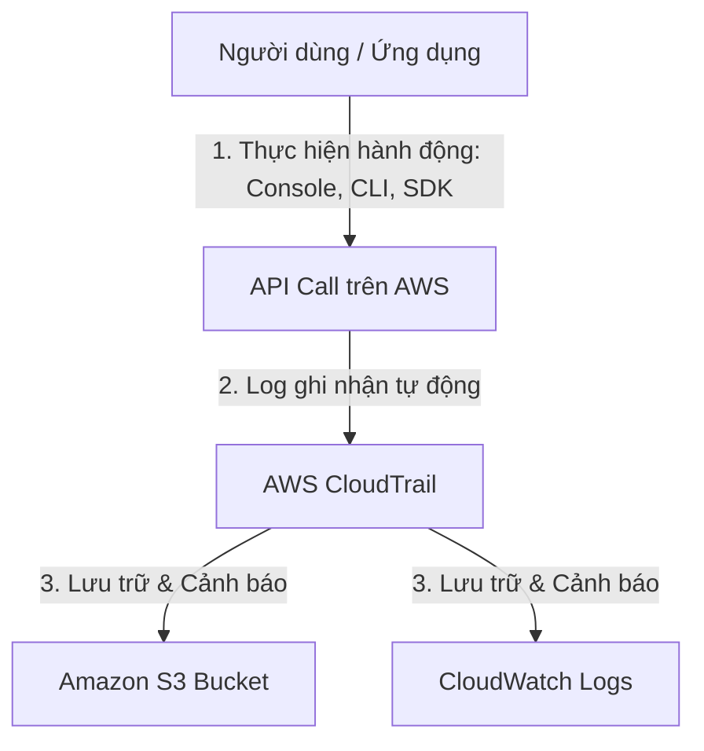

# 7. What is CloudTrail (AWS CloudTrail là gì?)

**AWS CloudTrail** là dịch vụ hỗ trợ quản trị, tuân thủ (compliance), kiểm toán hoạt động (auditing) và đánh giá rủi ro cho tài khoản AWS của bạn.

---

## I. Nguyên lý hoạt động của CloudTrail

CloudTrail ghi lại lịch sử các cuộc gọi API (API calls) được thực hiện trong tài khoản AWS của bạn. Bất kể hành động nào được thực hiện bởi một người dùng IAM, một IAM Role, một dịch vụ AWS hay thông qua AWS Console, CLI, SDK đều được ghi lại thành một sự kiện (Event) trong CloudTrail.

Mỗi bản ghi sự kiện trong CloudTrail chứa đầy đủ các thông tin:
* **Ai** đã thực hiện cuộc gọi API (User name, IAM Role, AWS Account).
* **Khi nào** hành động xảy ra (Timestamp).
* **Từ đâu** (Địa chỉ IP nguồn, User Agent).
* **Cái gì** đã được yêu cầu (Tên API, các tham số đầu vào).
* **Kết quả** ra sao (Thành công hay thất bại, mã lỗi trả về).

---

## II. So sánh sự khác biệt cốt lõi giữa CloudWatch và CloudTrail

Rất nhiều người mới học AWS dễ bị nhầm lẫn giữa hai dịch vụ này. Hãy ghi nhớ bảng so sánh dưới đây:

| Yếu tố | Amazon CloudWatch | AWS CloudTrail |
|---|---|---|
| **Mục đích chính** | Giám sát **hiệu năng** tài nguyên và ứng dụng (Performance & Resources). | Kiểm toán **hoạt động** và hành vi trên tài khoản (Auditing & User activity). |
| **Hỏi câu hỏi** | "Hạ tầng của tôi hoạt động thế nào? CPU của EC2 có bị quá tải không?" | "Ai đã làm gì trên hệ thống? Ai đã xóa cái EC2 instance này vào đêm qua?" |
| **Dữ liệu chính** | Metrics (số liệu đo lường), Logs (nhật ký hệ thống/ứng dụng), Alarms. | API Events (lịch sử cuộc gọi API dưới dạng JSON). |
| **Đối tượng thu thập** | Bên trong hệ điều hành (qua Agent) và bên ngoài tài nguyên. | Mức độ quản trị hạ tầng (Control Plane / Data Plane). |
