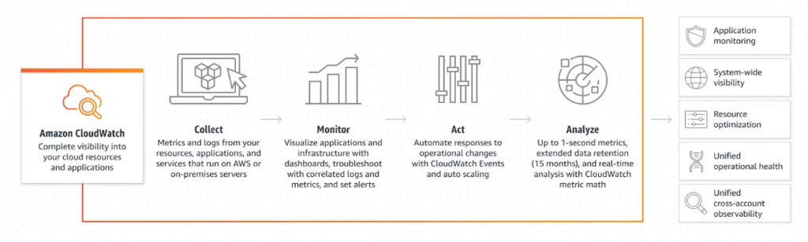

# 8. CloudWatch Insights (Phân tích chuyên sâu CloudWatch)

CloudWatch Insights cung cấp các bộ công cụ được tối ưu hóa đặc biệt nhằm đơn giản hóa việc tự động thu thập, tổng hợp và phân tích chuyên sâu các metrics và logs chi tiết từ các môi trường ứng dụng serverless và container.

  

---

## I. Tổng quan về CloudWatch Insights

Mặc dù CloudWatch mặc định có thể giám sát ở mức cơ bản, nhưng đối với các hạ tầng phân tán hiện đại như Microservices chạy trên Container hoặc Lambda, bạn cần các số liệu chi tiết hơn ở cấp độ ứng dụng. CloudWatch Insights giải quyết vấn đề này qua hai giải pháp chính:

### 1. Container Insights (Giám sát Container)
* **Đối tượng:** Áp dụng cho các ứng dụng chạy trên **Amazon ECS (Elastic Container Service)**, **Amazon EKS (Elastic Kubernetes Service)**, AWS Fargate, và máy chủ Kubernetes chạy trên EC2.
* **Tính năng:** Tự động thu thập các số liệu hiệu năng chi tiết ở nhiều cấp độ khác nhau như Cluster (Cụm), Service (Dịch vụ), Task (Tác vụ), Node (Nút), Pod và Container (như tỷ lệ CPU/RAM, dữ liệu mạng vào/ra, dung lượng ổ đĩa sử dụng).
* **Lợi ích:** Cung cấp các dashboard được thiết kế sẵn giúp đội ngũ vận hành cô lập nhanh chóng các pod/container bị quá tải hoặc rò rỉ tài nguyên.

### 2. Lambda Insights (Giám sát Serverless)
* **Đối tượng:** Áp dụng cho các hàm **AWS Lambda**.
* **Tính năng:** Thu thập và tổng hợp các số liệu hiệu năng hệ thống chuyên sâu bao gồm: CPU time, bộ nhớ RAM thực tế sử dụng (Memory Usage), lưu lượng Network IO và thời gian thực thi (Duration).
* **Lợi ích:** Giúp nhà phát triển dễ dàng phát hiện lỗi rò rỉ bộ nhớ ứng dụng (Memory leaks), tối ưu hóa dung lượng RAM phân bổ để tiết kiệm chi phí, và phân tích các trường hợp bị **Khởi động lạnh (Cold Starts)** kéo dài.

---

## II. Minh họa Giám sát Lambda với Lambda Insights

Dưới đây là ví dụ trực quan về giao diện giám sát hiệu năng của Lambda khi tính năng **Lambda Insights** được kích hoạt:

### 1. Biểu đồ giám sát hiệu năng tổng quan (Performance Monitoring)
Hiển thị đồng thời các biểu đồ về Chi phí (Function Cost), Thời gian thực thi (Duration), Số lần gọi (Invocations), Lỗi (Errors), Dung lượng RAM sử dụng tối đa (Memory Usage Max) và Lưu lượng mạng (Network Usage) của từng phiên bản hàm Lambda:

  

### 2. Bảng tổng hợp chi tiết theo từng Function (Function Summary)
Thống kê chi tiết các thông số của từng hàm Lambda bao gồm số lần gọi (Invocations), CPU time thực tế tiêu thụ, dung lượng Network IO, tỷ lệ bộ nhớ sử dụng lớn nhất (Max Memory %) và đặc biệt là số lần bị **Khởi động lạnh (Cold Starts)** để tìm cách tối ưu hóa:

  

