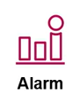
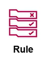

# 9. AWS X-Ray (Giám sát dấu vết cuộc gọi - Distributed Tracing)

AWS X-Ray giúp các nhà phát triển và kỹ sư DevOps phân tích, chẩn đoán lỗi và khắc phục sự cố đối với các ứng dụng phân tán và kiến trúc vi dịch vụ (microservices). Dịch vụ cung cấp cái nhìn toàn cảnh (end-to-end) và chi tiết về hành trình của các request khi chúng đi qua toàn bộ các thành phần trong hệ thống.

  

---

## I. Tổng quan về AWS X-Ray

Trong kiến trúc Monolith truyền thống, việc tìm lỗi khá đơn giản bằng cách đọc log của một máy chủ duy nhất. Tuy nhiên, trong kiến trúc Microservices và Serverless, một request từ Client có thể đi qua API Gateway, kích hoạt Lambda, truy vấn DynamoDB, gọi API bên thứ ba, rồi ghi dữ liệu vào S3. Nếu request bị chậm hoặc lỗi, bạn rất khó biết lỗi phát sinh từ mắt xích nào.

AWS X-Ray giải quyết bài toán này bằng cách cung cấp khả năng **Distributed Tracing (Theo dõi dấu vết phân tán)**:

* **Visualizing:** Tự động vẽ sơ đồ trực quan kết nối giữa các dịch vụ dựa trên các request thực tế (**Service Map**), cho biết chặng nào đang bị nghẽn cổ chai (latency cao) hoặc phát sinh lỗi HTTP 4xx/5xx.
* **Tracing End-to-End:** Gom tất cả logs và metrics liên quan của một request trên nhiều dịch vụ khác nhau thành một thực thể duy nhất gọi là **Trace**.
* **Phân tích nguyên nhân gốc rễ (Root Cause Analysis):** Giúp bạn khoan sâu vào từng dòng code, chặng gọi cơ sở dữ liệu (Database query) hay lời gọi API HTTP để xem chính xác chặng đó mất bao nhiêu mili-giây.

---

## II. Các khái niệm quan trọng trong X-Ray

* **Segment:** Chứa thông tin về chặng công việc mà một tài nguyên AWS (như EC2, ECS, Lambda) thực hiện khi xử lý request. Mỗi segment bao gồm tên dịch vụ, chi tiết request (URL, method) và trạng thái phản hồi.
* **Subsegment:** Chi tiết hóa các tác vụ nhỏ hơn nằm bên trong một segment. Ví dụ: thời gian thực hiện một truy vấn SQL cụ thể, hoặc thời gian gọi một API HTTP bên thứ ba.
* **Trace (Dấu vết):** Tập hợp tất cả các segment và subsegment tạo nên hành trình trọn vẹn của một request từ khi bắt đầu cho đến khi trả kết quả về cho client. Mỗi Trace được định danh bằng một **Trace ID** duy nhất truyền qua header của request (`X-Amzn-Trace-Id`).
* **Sampling (Lấy mẫu):** Để tối ưu hóa chi phí và hiệu năng, X-Ray sử dụng thuật toán lấy mẫu để quyết định request nào sẽ được trace (mặc định trace 1 request mỗi giây và 5% số request bổ sung).

---

## III. Minh họa Tracing chặng API Gateway + Lambda

Dưới đây là ví dụ trực quan về một Trace đi qua chặng **API Gateway** kết nối tới **AWS Lambda**:

  

### Phân tích biểu đồ Trace:
1. **Trace Map (Bản đồ dấu vết):** Trực quan hóa đường đi của request từ `Client` -> đi qua API Gateway Stage (`udemy-test-api/dev`) -> đến Lambda Context (`udemy-test-calculator-function`).
2. **Segments Timeline (Dòng thời gian):** Chi tiết hóa thời gian xử lý của từng chặng:
   * **API Gateway Stage (`udemy-test-api/dev`):** Tổng thời gian xử lý chặng này là **28ms** (HTTP Status: 200 OK).
   * **Lambda Context (`udemy-test-calculator-function`):** Hàm Lambda thực tế chỉ tốn **14ms** để xử lý logic tính toán.
   * **Phân tích Latency:** Nhìn vào timeline, ta thấy chênh lệch 14ms giữa API Gateway và Lambda. Đây chính là overhead của API Gateway (dùng để thực hiện định tuyến, xác thực, hoặc thiết lập kết nối). Nếu tổng thời gian phản hồi tăng cao, timeline này sẽ chỉ rõ chặng nào đang kéo dài thời gian xử lý của hệ thống.
