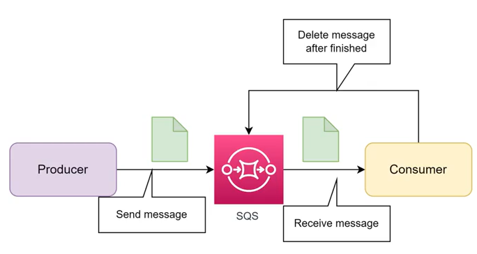
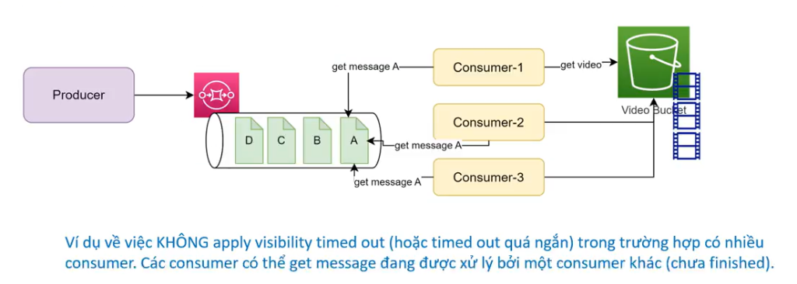
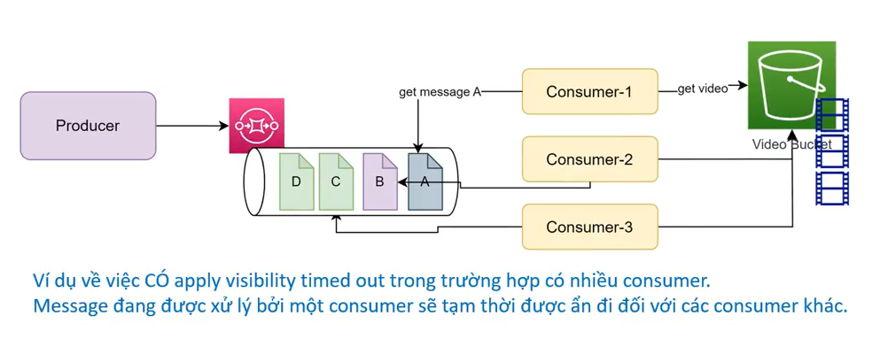
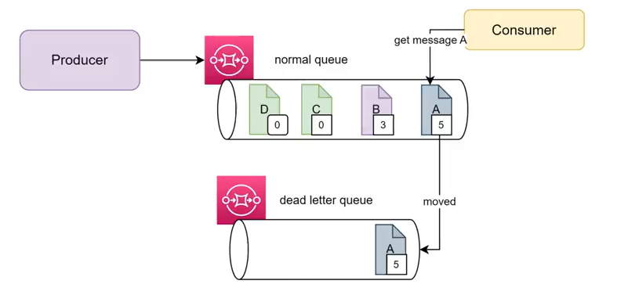
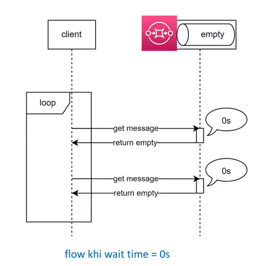
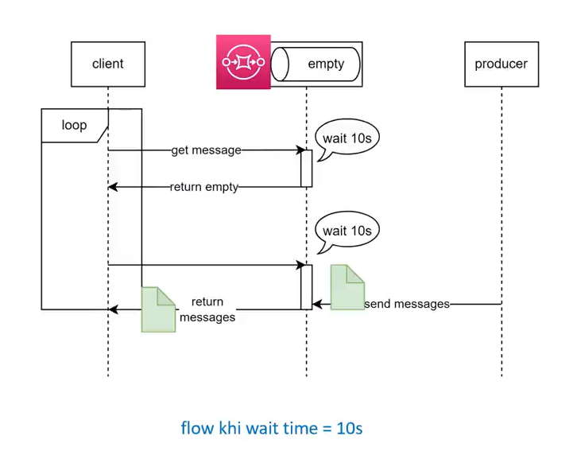

# 2. Các khái niệm cơ bản trong SQS

Về cơ bản SQS là nơi có nhiệm vụ trung chuyển giữa một bên là **Message Producer (Sender)** và một bên là **Message Consumer (Receiver)**.

---

## I. Vai trò trung chuyển của SQS

Producer chịu trách nhiệm gửi tin nhắn (Send message) vào SQS. Consumer chủ động thăm dò hàng đợi để nhận tin nhắn (Receive message). Sau khi xử lý xong, Consumer phải xác nhận và xóa tin nhắn (Delete message) để dọn dẹp hàng đợi.

  

### Quản lý vòng đời của message:
* **Với Standard Queue:** Message khi được gửi vào queue sẽ tồn tại ở đó cho tới khi bị xoá hoặc hết thời gian retention. Do vậy Consumer phải chủ động xoá message đã xử lý xong.  
* **Với FIFO Queue:** Message sẽ được delivery chính xác 1 lần tới consumer (tự động bị xoá sau khi có event receive message).

---

## II. Visibility Timeout

SQS có một thông số gọi là **Visibility Timeout**, là thời gian message tạm bị ẩn đi đối với các consumer trong khi message đó đang được receive bởi một consumer. Quá thời gian này nếu message chưa bị xoá sẽ quay trở lại queue.

### 1. Kịch bản KHÔNG áp dụng Visibility Timeout (hoặc timeout quá ngắn)
Nếu không cấu hình Visibility Timeout hoặc cấu hình quá ngắn so với thời gian xử lý thực tế của consumer:
* Khi **Consumer-1** lấy message A để xử lý, message A vẫn hiển thị hoặc nhanh chóng xuất hiện lại trong queue.
* Các consumer khác (**Consumer-2** và **Consumer-3**) cũng sẽ nhận được message A và xử lý song song, dẫn đến xung đột hoặc trùng lặp dữ liệu xử lý.

  

### 2. Kịch bản CÓ áp dụng Visibility Timeout phù hợp
Khi Visibility Timeout được cấu hình chính xác:
* Trong lúc **Consumer-1** đang xử lý message A, message A sẽ lập tức bị ẩn đi (ở trạng thái xám).
* Các consumer khác (**Consumer-2** và **Consumer-3**) khi poll hàng đợi chỉ nhìn thấy các tin nhắn tiếp theo (như B, C, D) mà không thể truy cập message A, tránh xử lý trùng lặp.

  

### Cách cấu hình Visibility Timeout phù hợp
Việc apply Visibility Timeout như thế nào cho phù hợp hoàn toàn phụ thuộc vào nghiệp vụ của bạn.

> [!IMPORTANT]
> **Ví dụ:** Nếu một tác vụ giải mã video mất **10 phút**, bạn nên đặt Visibility Timeout **> 10 phút** để tránh xung đột xử lý giữa các consumer. Nếu đặt quá ngắn (ví dụ: 2 phút), các worker khác sẽ lấy lại chính message video đó để xử lý trong khi worker đầu tiên chưa hoàn thành, gây lãng phí tài nguyên và lỗi hệ thống.

---

## III. Dead Letter Queue (DLQ)

Message mỗi khi được receive sẽ có một thông số **receive count** (được cộng lên +1 mỗi khi message đó được receive bởi một consumer), ta có thể dựa vào đó để setting **Dead Letter Queue (DLQ)** (tự động move message đã bị xử lý quá số lần mà vẫn chưa thành công).

**Ví dụ:**
Như hình dưới ta có 2 queue, apply dead-letter queue với receive count = 5. Khi tới ngưỡng giới hạn mà message vẫn chưa được xử lý thành công và xoá khỏi queue, ta sẽ move sang một queue khác (dead-letter queue) để xử lý và phân tích sau.

  

---

## IV. Long Polling Wait Time

**Long polling wait time** là thời gian để SQS chờ trước khi return empty cho consumer trong trường hợp không có message nào trên queue.

### 1. Luồng xử lý với Wait Time = 0s (Short Polling)
Khi thời gian chờ được đặt thành 0 giây, consumer liên tục truy vấn hàng đợi. Nếu hàng đợi trống, SQS sẽ lập tức trả về phản hồi trống. Vòng lặp này tiêu thụ nhiều CPU và kích hoạt một số lượng lớn các cuộc gọi API trống, làm tăng chi phí AWS của bạn.

  

### 2. Luồng xử lý với Wait Time = 10s (Long Polling)
Khi thời gian chờ được đặt lớn hơn 0 (ví dụ: 10 giây), máy chủ SQS sẽ giữ kết nối yêu cầu của consumer. 
* Nếu producer gửi message trong khoảng thời gian này, SQS sẽ trả về ngay lập tức.
* Nếu không có message nào đến sau thời gian chờ (10 giây), SQS mới trả về phản hồi trống. Điều này giảm thiểu đáng kể các phản hồi API trống và tối ưu hóa tài nguyên.

  

