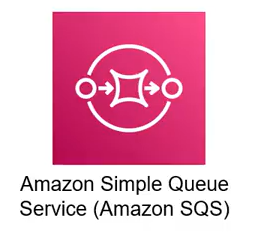

# 5. Giới hạn dịch vụ SQS (SQS Quotas and Limits)

  

Amazon Simple Queue Service (SQS) được thiết kế là một hệ thống truyền tin nhắn phân tán có khả năng mở rộng cực cao và đáng tin cậy. Tuy nhiên, để đảm bảo hiệu suất tối ưu và phân bổ tài nguyên hợp lý, AWS áp dụng các giới hạn và cấu hình cụ thể.

---

## I. Các giới hạn cốt lõi của SQS (Service Limitations)

Dưới đây là bảng tổng hợp chi tiết các giới hạn dịch vụ và thông số cấu hình của hàng đợi cũng như thông điệp trong SQS.

| Chỉ số / Tính năng | Giới hạn / Thông số | Mô tả |
| :--- | :--- | :--- |
| **Số lượng message trên một queue** | **Không giới hạn (unlimited)** | Không giới hạn tổng số lượng message mà một hàng đợi có thể chứa. |
| **Độ dài tên Queue (Queue name)** | **80 ký tự (80 characters)** | Tên của hàng đợi có độ dài tối đa là 80 ký tự. Các ký tự được phép sử dụng bao gồm chữ cái, chữ số, dấu gạch ngang (`-`), và dấu gạch dưới (`_`). Tên FIFO queue phải kết thúc bằng hậu tố `.fifo`. |
| **Thẻ tag của Queue (Queue tag)** | **50 thẻ (50 tags)** | Bạn có thể gắn tối đa 50 thẻ tag metadata (cặp key-value) cho mỗi hàng đợi SQS. |
| **Thời gian chờ Long polling** | **20 giây (20s)** | Thời gian chờ tối đa cho một yêu cầu nhận tin nhắn là 20 giây. |
| **Visibility Timeout của Message** | **Từ 0 giây đến 12 giờ (0s - 12 hours)** | Visibility timeout tối thiểu là 0 giây, tối đa là 12 giờ. Mặc định là 30 giây. |
| **Kích thước Message tối đa (Message size max)** | **256 KB** | Kích thước tối đa của một message là 256 KB. Để gửi các payload lớn hơn, bạn có thể lưu trữ trong S3 và sử dụng Amazon SQS Extended Client Library. |
| **Thuộc tính tin nhắn (Message attributes)** | **10 thuộc tính (10 attributes)** | Bạn có thể đính kèm tối đa 10 thuộc tính metadata tùy biến cho mỗi message. |
| **Nội dung Message (Message content)** | **XML, JSON, Text** | Nội dung của message có thể bao gồm định dạng XML, JSON, hoặc văn bản thường (Text). Dữ liệu nhị phân không định dạng cũng có thể gửi nếu được mã hóa (ví dụ: Base64). |
| **Thời gian lưu trữ Message (Message retention)** | **Từ 1 phút đến 14 ngày** | Thời gian lưu trữ tối thiểu là 1 phút, tối đa là 14 ngày. Mặc định là 4 ngày (default 4 days). |

---

## II. Các lưu ý quan trọng khi cấu hình

### 1. Thời gian lưu giữ tin nhắn (Retention) vs. Visibility Timeout
* **Visibility Timeout:** Tạm thời ẩn tin nhắn khỏi các consumer khác trong khi một consumer đang xử lý nó. Nếu hết thời gian timeout mà tin nhắn chưa bị xóa, nó sẽ xuất hiện lại trong hàng đợi.
* **Message Retention Period:** Tự động xóa tin nhắn khỏi hàng đợi khi hết thời gian lưu giữ cấu hình, bất kể tin nhắn đã được xử lý hay chưa.

> [!WARNING]
> Nếu thời gian lưu giữ tin nhắn hết hạn trong khi tin nhắn đang bị ẩn bởi Visibility Timeout, tin nhắn đó sẽ bị xóa khỏi hàng đợi ngay lập tức.

### 2. Giới hạn kích thước tin nhắn
Giới hạn kích thước tối đa 256 KB áp dụng cho tổng kích thước của cả phần thân tin nhắn (message body) và tất cả các thuộc tính đính kèm (message attributes).

> [!TIP]
> Để gửi các tin nhắn lớn hơn 256 KB (lên tới 2 GB), bạn nên sử dụng **Amazon SQS Extended Client Library for Java** (hoặc tương đương). Thư viện này tự động upload nội dung tin nhắn lên Amazon S3 và gửi liên kết tham chiếu (reference pointer) vào hàng đợi SQS.
