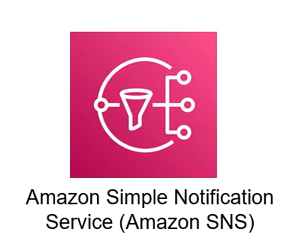

# 8. Tổng quan SNS (Simple Notification Service - SNS)

  

AWS Simple Notification Service (SNS) là một dịch vụ thông báo (notification), cho phép bạn gửi thông báo đến các đối tượng khác nhau như các ứng dụng, người dùng (user), hệ thống, hoặc các dịch vụ khác trên AWS.  

SNS cho phép bạn gửi thông báo bằng nhiều phương thức khác nhau như email, SMS, push notifications (thông báo trên điện thoại di động), hoặc gọi trực tiếp API (API Call). Bạn có thể tạo và quản lý các **topics** trong SNS, và sau đó gửi thông báo đến các chủ đề đó. Các đối tượng đã đăng ký (subscribed) vào chủ đề sẽ nhận được thông báo.

---

## I. Đặc trưng của SNS

* **Mô hình Publisher-Subscriber (Pub/Sub):** Về cơ bản SNS hoạt động theo mô hình Publisher-Subscriber. Tin nhắn (message) khi được bên publisher gửi lên SNS topic sẽ được đồng loạt phân phối (fan-out) tới tất cả các subscriber đã đăng ký.
* **Đa kênh thông báo:** SNS hỗ trợ nhiều kênh phân phối thông báo đa dạng bao gồm:
  * Email
  * SMS (tin nhắn điện thoại)
  * Mobile Push Notifications (thông báo đẩy trên các hệ điều hành iOS, Android...)
  * HTTP/HTTPS Webhook (gọi API Call)
  * Tích hợp dịch vụ AWS (SQS, Lambda)
* **Khả năng mở rộng và đáng tin cậy:** SNS xử lý việc phân phối thông báo dựa trên cơ sở hạ tầng có tính sẵn sàng cao và khả năng tự động co giãn của AWS, đảm bảo độ tin cậy khi gửi tin với số lượng lớn.
* **Tích hợp với các dịch vụ AWS khác:** SNS tích hợp chặt chẽ với các dịch vụ khác như SQS (mô hình SNS-SQS fanout), CloudWatch (ghi nhận log & metric), AWS Lambda (kích hoạt xử lý code), Amazon EC2, và nhiều dịch vụ khác, cho phép bạn tự động hóa quy trình vận hành.

---

## II. Các tính năng nâng cao của SNS

* **Hỗ trợ FIFO (First-In-First-Out):** Tương tự như SQS, SNS hỗ trợ loại Topic FIFO đảm bảo phân phối tin nhắn theo đúng thứ tự và không bị trùng lặp.
* **Thuộc tính tin nhắn (Message attributes):** Cho phép bạn gán thêm các thông tin metadata tùy chọn (cặp key-value) cho message mà không cần thay đổi nội dung phần thân (payload).
* **Lọc tin nhắn (Message Filtering):** Cho phép cấu hình các bộ lọc (filter policy) tại phía subscription để quyết định xem subscriber đó có nhận message hay không dựa trên các thuộc tính tin nhắn, giúp tối ưu hóa luồng nhận tin nhắn.
* **Bảo mật tin nhắn (Message security):** Tích hợp với dịch vụ AWS KMS để mã hóa tin nhắn ở trạng thái lưu trữ (Encryption at rest), tăng cường tính bảo mật cho dữ liệu nhạy cảm.
