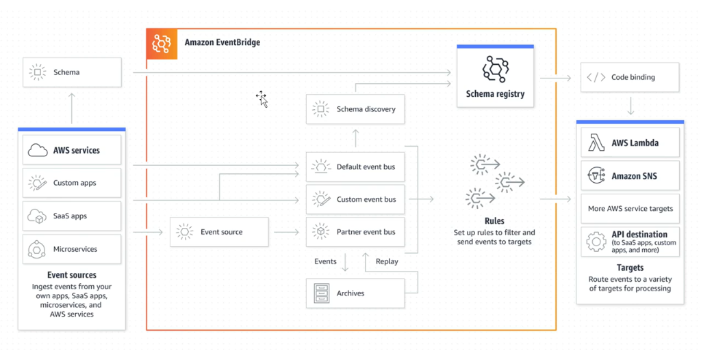

# Amazon EventBridge Overview

  

## I. Amazon EventBridge là dịch vụ gì?
**AWS EventBridge** là một dịch vụ quản lý và định tuyến sự kiện (Event Bus / Event Router) không máy chủ (Serverless) được cung cấp bởi Amazon Web Services (AWS). Nó cho phép bạn theo dõi, xử lý và phản ứng tự động đối với các thay đổi hoặc sự kiện từ các nguồn khác nhau trong môi trường AWS Cloud, ứng dụng SaaS (Software-as-a-Service) hoặc các ứng dụng tự phát triển của riêng bạn.

EventBridge hoạt động dựa trên **kiến trúc hướng sự kiện (Event-Driven Architecture)** theo mô hình **Publish-Subscribe**. Trong đó, nguồn phát sự kiện (Event Source) gửi thông tin sự kiện của mình tới EventBridge, và EventBridge có nhiệm vụ định tuyến chính xác sự kiện đó tới các đối tượng đích (Event Targets) đã được đăng ký trước.

---

## II. Cách thức hoạt động & Kiến trúc định tuyến

  

Luồng xử lý sự kiện trong EventBridge diễn ra như sau:
1. **Event Source (Nguồn phát sự kiện):** Có thể là các dịch vụ AWS (như EC2, S3, RDS khi thay đổi trạng thái), các ứng dụng SaaS tích hợp (như Zendesk, Shopify, Datadog), hoặc ứng dụng custom của bạn (gửi qua API).
2. **Event Bus (Đường truyền sự kiện):** Là nơi tiếp nhận các sự kiện. Mặc định luôn có một `default` event bus thu thập tất cả các sự kiện từ các dịch vụ AWS. Bạn cũng có thể tạo Custom Event Bus hoặc SaaS Partner Event Bus.
3. **Event Rules (Quy tắc lọc):** Bộ định tuyến thông minh. Bạn cấu hình các quy tắc (Rules) để lọc và so khớp các sự kiện dựa trên:
   * *Kiểu sự kiện (Event Type)*
   * *Nguồn sự kiện (Event Source)*
   * *Nội dung/Thuộc tính chi tiết của sự kiện (Event Pattern)*
4. **Event Targets (Đối tượng đích):** Khi một sự kiện khớp với Rule, EventBridge sẽ chuyển tiếp nó tới một hoặc nhiều target được chỉ định như:
   * AWS Lambda Functions
   * Amazon SQS Queues / Amazon SNS Topics
   * AWS Step Functions State Machines (Workflows)
   * Các API Endpoint bên ngoài AWS (thông qua API Destinations)

---

## III. Các tính năng nổi bật của EventBridge

* **Định tuyến theo thời gian thực (Real-time Routing):** Lọc và chuyển tiếp sự kiện ngay lập tức khi chúng xảy ra, giảm thiểu tối đa độ trễ.
* **Tích hợp SaaS không cần code (SaaS Integration):** Kết nối trực tiếp và an toàn với hàng chục ứng dụng SaaS phổ biến của bên thứ ba mà không cần viết các webhook phức tạp.
* **Hỗ trợ Cron / Scheduled Events:** Cho phép lập lịch chạy định kỳ tương tự như hệ thống cron job truyền thống (trước đây là CloudWatch Events) để thực hiện các tác vụ tự động hóa theo thời gian cụ thể.
* **Event Replay & Archive:** Khả năng ghi lại (Archive) toàn bộ sự kiện truyền qua bus và phát lại (Replay) chúng khi cần thiết (rất hữu ích trong việc debug, khôi phục dữ liệu hoặc kiểm thử).

---

## IV. Lợi ích khi sử dụng EventBridge

* **Khử liên kết hệ thống (Decoupling):** Tách biệt hoàn toàn phần phát sự kiện và phần xử lý sự kiện. Publisher không cần biết ai sẽ nhận sự kiện và Consumer không cần biết ai đã phát nó.
* **Khả năng mở rộng vượt trội (Scalability):** Là dịch vụ Serverless, EventBridge tự động mở rộng quy mô theo khối lượng sự kiện thực tế mà không cần bạn quản lý hạ tầng hay phân bổ dung lượng.
* **Tăng tốc độ phát triển:** Tập trung hoàn toàn vào viết code xử lý logic nghiệp vụ ở target (như Lambda) thay vì phải tự xây dựng các module định tuyến và lắng nghe sự kiện phức tạp.
