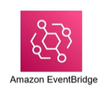
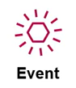
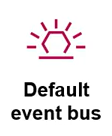
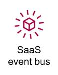
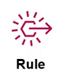
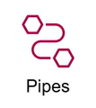
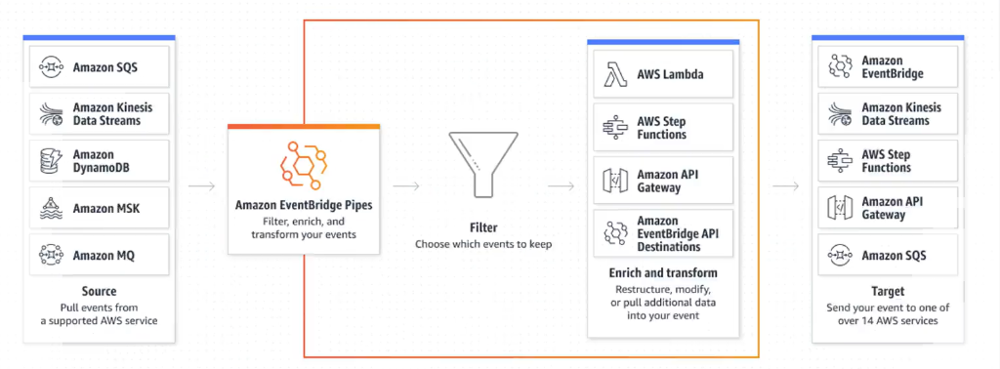
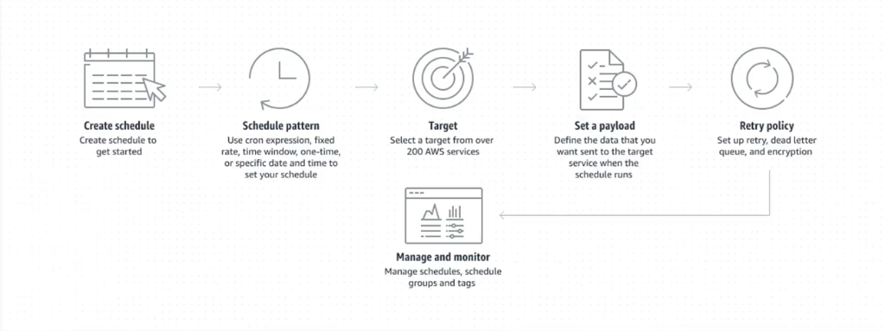

# Các thành phần trong Amazon EventBridge

  

Để xây dựng một hệ thống hướng sự kiện (Event-Driven System) hiệu quả với **Amazon EventBridge**, bạn cần hiểu rõ các thành phần cốt lõi cấu tạo nên dịch vụ này. Dưới đây là mô tả chi tiết của từng thành phần:

---

## 1. Event (Sự kiện)

  

**Sự kiện** là một bản ghi dữ liệu (ở định dạng JSON) đại diện cho một thay đổi về trạng thái hoặc một hành động cụ thể diễn ra trong hệ thống:
* **Nguồn gốc:** Có thể do các dịch vụ AWS tự động tạo ra (ví dụ: một tệp tin vừa được tải lên S3), hoặc do ứng dụng của bạn chủ động phát đi thông qua các lời gọi API.
* **Cấu trúc:** Chứa các thông tin chi tiết như: thời gian xảy ra, nguồn phát (Source), tài nguyên liên quan (Resources), và nội dung chi tiết của sự kiện (Detail).

---

## 2. Event Bus (Kênh giao tiếp sự kiện)
**Event Bus** là đường truyền vật lý hoặc kênh giao tiếp có nhiệm vụ tiếp nhận các sự kiện được gửi đến:
* **Default Event Bus:** Được AWS tạo sẵn cho mỗi tài khoản để tự động tiếp nhận tất cả các sự kiện từ các dịch vụ AWS.
    
* **Custom Event Bus:** Bạn có thể tự tạo các bus riêng biệt cho từng ứng dụng hoặc phòng ban để phân loại và bảo mật luồng sự kiện.
    
* **SaaS Partner Event Bus:** Nhận sự kiện từ các ứng dụng của đối tác bên thứ ba (ví dụ: Shopify, Zendesk).
    

---

## 3. Rule (Quy tắc định tuyến)

  

**Rule** định nghĩa bộ lọc thông minh để xác định xem sự kiện nào sẽ được chuyển tiếp đi và chuyển tiếp tới đâu:
* **Matching Pattern:** Rule so khớp cấu trúc JSON của sự kiện đầu vào. Nếu sự kiện trùng khớp với mẫu quy định (Event Pattern), Rule sẽ được kích hoạt.
* **Routing:** Một Rule có thể định tuyến sự kiện tới tối đa **5 đối tượng đích (Targets)** cùng một lúc.
* **Biến đổi dữ liệu:** Rule cũng cho phép bạn tùy chỉnh hoặc chuyển đổi định dạng (Transform) nội dung JSON của sự kiện trước khi gửi tới Target.

---

## 4. Target (Đối tượng đích)
**Target** là nơi tiếp nhận và xử lý sự kiện sau khi đã được Rule định tuyến thành công:
* **Hỗ trợ đa dạng:** Target có thể là các dịch vụ tính toán (AWS Lambda), lưu trữ/hàng đợi (SQS, SNS, Kinesis), workflow (Step Functions), hoặc thậm chí là một API Endpoint của ứng dụng chạy ngoài AWS (thông qua API Destinations).

---

## 5. Schema (Cấu trúc dữ liệu)

  

**Schema** định nghĩa cấu trúc rõ ràng của dữ liệu JSON trong một sự kiện (bao gồm các trường dữ liệu, kiểu dữ liệu của từng trường):
* Giúp các nhà phát triển biết chính xác định dạng dữ liệu của sự kiện đầu vào để viết code xử lý tương thích ở Target.
* Hỗ trợ xuất trực tiếp schema thành các mô hình đối tượng (Code Bindings) bằng các ngôn ngữ lập trình như Java, Python, TypeScript... giúp lập trình viên viết code dễ dàng hơn.

---

## 6. Schema Registry (Kho lưu trữ cấu trúc)

  

**Schema Registry** là nơi quản lý và lưu trữ tập trung tất cả các Schema:
* **Tự động dò tìm (Schema Discovery):** EventBridge có tính năng tự động phân tích các sự kiện truyền qua bus để nhận diện và sinh ra Schema tương ứng mà không cần khai báo thủ công.

---

## 7. Pipes (Đường ống kết nối trực tiếp)

  

  

**Amazon EventBridge Pipes** là một tính năng mạnh mẽ giúp thiết lập kết nối điểm-điểm (point-to-point) trực tiếp giữa một Event Source và một Target:
* **Tích hợp sẵn:** Phù hợp nhất để kết nối các hàng đợi hoặc luồng dữ liệu (ví dụ: từ DynamoDB Streams, SQS, Kinesis) sang Target mà không cần viết code trung gian.
* **Bộ lọc và Làm phong phú (Filter & Enrichment):** Cho phép bạn lọc bỏ các bản ghi không cần thiết hoặc gọi một API/Lambda để biến đổi, làm giàu dữ liệu trước khi chuyển tiếp tới Target.

---

## 8. Scheduler (Lập lịch tác vụ)

  

  

**Amazon EventBridge Scheduler** là bộ lập lịch serverless cực kỳ mạnh mẽ:
* Cho phép bạn tạo, quản lý và kích hoạt hàng triệu tác vụ định kỳ (sử dụng biểu thức Cron/Rate) hoặc tác vụ chạy một lần duy nhất tại một thời điểm chính xác.
* Có khả năng kích hoạt trực tiếp hơn 270 dịch vụ AWS và hơn 6,000 hành động API khác nhau.
