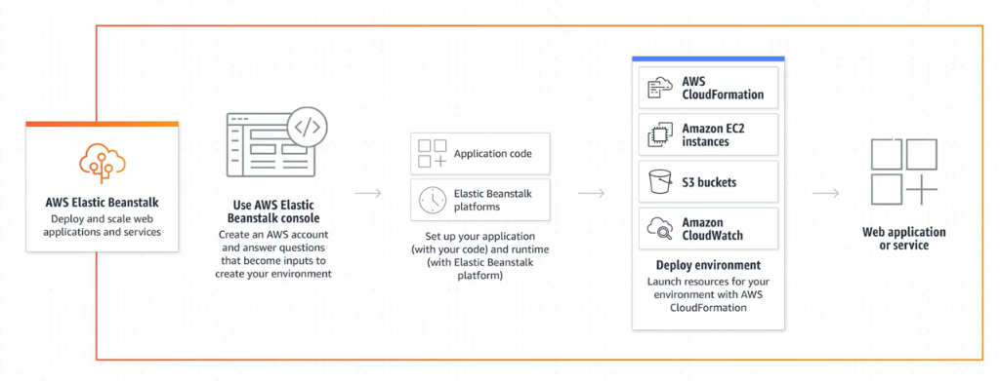

# 2. Các tính năng của Elastic Beanstalk

  

## Các tính năng chính

* **Tự động tạo ra môi trường và các tài nguyên liên quan:** AWS Elastic Beanstalk lo toàn bộ công việc từ việc cấp phát tài nguyên như EC2, S3, RDS...
* **Cung cấp khả năng Auto Scaling:** Tự động mở rộng hoặc thu hẹp tài nguyên để đáp ứng lưu lượng truy cập thay đổi linh hoạt.
* **Monitoring thông qua giao diện thân thiện:** Giúp bạn theo dõi được tình trạng của ứng dụng cũng như môi trường hoạt động (tích hợp sẵn với CloudWatch).
* **Hỗ trợ đa dạng platform:** Hỗ trợ sẵn các nền tảng phổ biến như Java, .NET, Node.js, PHP, Ruby, Python, Go, và Docker.
* **Đa dạng hình thức Deploy:** Có thể deploy từ AWS Console, EB CLI, VS Code, Eclipse... Hỗ trợ các deployment policies phức tạp như rolling, blue-green deployment.
* **Tự động update platform version:** Tự động nâng cấp, cập nhật môi trường chạy (OS, Runtime) khi có version mới hoặc khi cần thiết.
