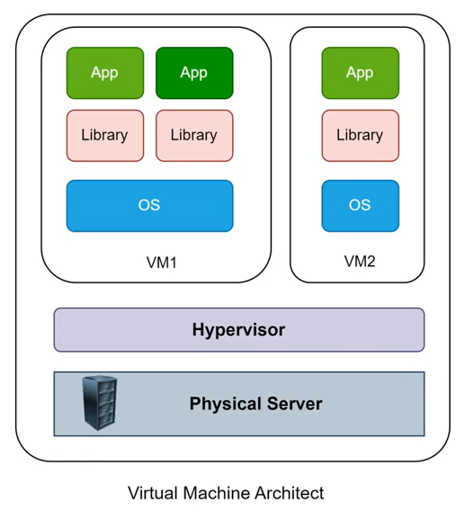
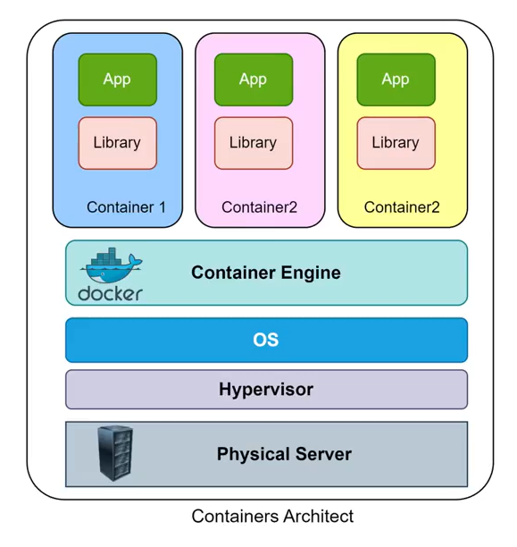

# 1. Container là gì? Tại sao sử dụng Container?

Cùng xét một mô hình về việc deployment sử dụng máy ảo (VM) hay các EC2 server truyền thống.

## Problem khi sử dụng VM
* **Xung đột version** giữa Library, Binary, Runtime cùng cài trên các VM.
* **Không có khả năng độc lập môi trường** giữa các ứng dụng chạy trên cùng một máy chủ.
* **Mất thời gian trong việc triển khai** (chuẩn bị hệ điều hành, cài đặt các library cần thiết, setup môi trường, v.v.).
* **Khó đảm bảo tính nhất quán** của ứng dụng được triển khai (ứng dụng work OK trên môi trường này nhưng không chắc sang môi trường khác chạy bình thường).

  

## Container ra đời để giải quyết những vấn đề trên
Bằng cách:
* **Đóng gói ứng dụng** cùng với những thứ cần thiết để chạy được ứng dụng đó thành một **image** có thể run ở bất cứ đâu có hỗ trợ container.
* Cung cấp **môi trường & cơ chế cấp phát tài nguyên** để image đó có thể run được.
* Cung cấp **cơ chế & công cụ** cho phép các nhà phát triển đóng gói, lưu trữ, phân phối và triển khai ứng dụng một cách thuận tiện.

  

## Lợi ích của việc sử dụng Container
1. **Độc lập với môi trường:** Containers cung cấp một cách để đóng gói ứng dụng và tất cả các dependencies của nó, bao gồm OS, libraries, tools. Nó cho phép ứng dụng chạy một cách độc lập và nhất quán trên bất kỳ môi trường nào.
2. **Đơn giản hóa quy trình triển khai:** Tính nhất quán, tốc độ, thuận tiện là những gì Containerization mang lại khi so sánh với mô hình truyền thống.
3. **Quản lý tài nguyên hiệu quả:** Triển khai ứng dụng bằng Container cho phép bạn chia sẻ và sử dụng tài nguyên của hệ thống một cách hiệu quả. Bằng cách chạy nhiều container trên cùng một máy chủ vật lý hoặc máy ảo, bạn có thể tận dụng tối đa khả năng tính toán và tài nguyên của hệ thống.
4. **Linh hoạt và mở rộng:** Containers cho phép bạn dễ dàng mở rộng ứng dụng theo nhu cầu. Bằng cách scale horizontal (mở rộng theo chiều ngang), ứng dụng có thể nhân bản để đáp ứng workload. Ngoài ra, việc triển khai nhiều version của một ứng dụng cùng lúc cũng trở nên dễ dàng.
