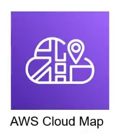

# 12. Giới thiệu Cloud Map

AWS Cloud Map là một “Cloud Service Discovery”. Với Cloud Map, bạn có thể xác định tên tùy chỉnh cho các tài nguyên ứng dụng của mình và dịch vụ này duy trì vị trí cập nhật của những tài nguyên thay đổi linh hoạt đó. Điều này làm tăng tính sẵn sàng của ứng dụng vì dịch vụ web của bạn luôn tìm ra vị trí mới nhất của các nguồn tài nguyên.

Cloud Map cho phép bạn đăng ký bất kỳ tài nguyên ứng dụng nào, chẳng hạn như DB, queue, micro service và cloud resource khác, với tên tùy chỉnh. Sau đó, Cloud Map liên tục kiểm tra tình trạng của tài nguyên để đảm bảo vị trí được cập nhật. Sau đó, ứng dụng có thể query đến registry để biết vị trí của các tài nguyên cần thiết dựa trên phiên bản ứng dụng và môi trường triển khai.

Một trong những ứng dụng phổ biến của AWS Cloud Map là trong kiến trúc dựa trên microservices. Bằng cách sử dụng Cloud Map, bạn có thể quản lý và theo dõi các dịch vụ ứng dụng microservice một cách linh hoạt và tự động.

  

