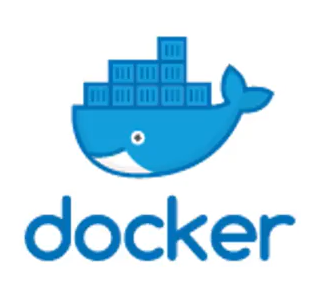
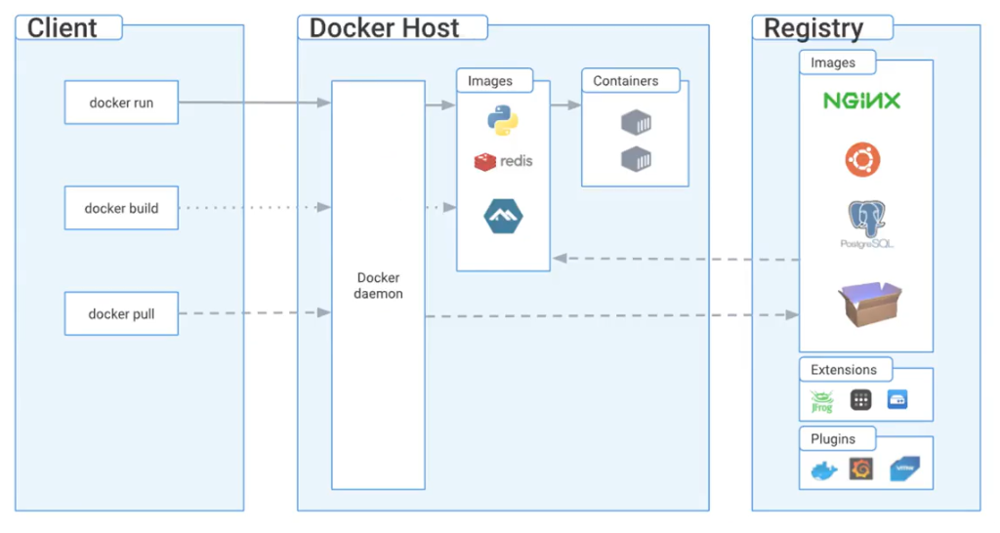

# 2. Docker là gì?

  

Docker là nền tảng phần mềm cho phép bạn dựng, kiểm thử và triển khai ứng dụng một cách nhanh chóng. Docker đóng gói phần mềm vào các đơn vị tiêu chuẩn hóa được gọi là **container** có mọi thứ mà phần mềm cần để chạy, trong đó có thư viện, công cụ hệ thống, mã nguồn và runtime (thời gian chạy). Bằng cách sử dụng Docker, bạn có thể nhanh chóng triển khai và thay đổi quy mô ứng dụng vào bất kỳ môi trường nào và biết chắc rằng mã của bạn sẽ chạy được một cách đồng nhất.

---

## Các thành phần cơ bản của Docker

  

1. **Docker daemon:** Là trung tâm quản lý các thành phần của Docker như image, container, volume, network. Docker daemon đóng vai trò lắng nghe và nhận API request từ Client để thực thi các nhiệm vụ.
2. **Docker Client:** Cung cấp phương thức giao tiếp (qua CLI hoặc giao diện) để người dùng tương tác với Docker daemon. Khi bạn gõ các lệnh như `docker run`, `docker build` hay `docker pull`, Client sẽ biên dịch và gửi yêu cầu này đến Daemon xử lý.
3. **Docker registry:** Nơi lưu trữ và phân phối các Docker image. Mặc định Docker sẽ kết nối tới registry công cộng lớn nhất là **Docker Hub**. Bạn có thể push image của mình lên đây để lưu trữ hoặc pull image của người khác về sử dụng. *(Lưu ý: Trên môi trường đám mây AWS, dịch vụ tương đương cung cấp private registry là Amazon ECR).*

*Lưu ý thêm: Khi bạn cài đặt phần mềm Docker Desktop trên máy tính cá nhân, cả Docker Daemon và Docker Client đều được đóng gói chung và cài đặt cùng lúc trên máy tính của bạn.*
