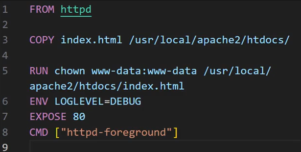

# 4. Làm quen với Dockerfile

  

`Dockerfile` là một tệp văn bản chứa các chỉ thị (instructions) được Docker sử dụng để tự động xây dựng một image. Dưới đây là các chỉ thị cơ bản thường gặp:

* **Khai báo Base image (`FROM`):**
  Dockerfile thường bắt đầu bằng một chỉ thị `FROM` để chỉ định base image mà Docker image mới sẽ dựa trên.
  *Ví dụ:* `FROM ubuntu:latest` hoặc `FROM httpd`.

* **Sao chép các tệp và thư mục (`COPY` hoặc `ADD`):**
  Sử dụng chỉ thị `COPY` (hoặc `ADD`), bạn có thể sao chép các tệp và thư mục từ máy chủ nơi Dockerfile đang được chạy vào bên trong Docker image.
  *Ví dụ:* `COPY app.py /app` hoặc `COPY index.html /usr/local/apache2/htdocs/`.

* **Chỉ thị `RUN`:**
  Bạn có thể thực thi các lệnh bên trong Docker image để cài đặt phần mềm, cập nhật gói phần mềm hoặc thực hiện các tác vụ khác trong quá trình build image.
  *Ví dụ:* `RUN apt-get update && apt-get install -y python` hoặc `RUN chown www-data:www-data /usr/local/apache2/htdocs/index.html`.

* **Thiết lập biến môi trường (`ENV`):**
  Bằng cách sử dụng chỉ thị `ENV`, bạn có thể định nghĩa các biến môi trường cho Docker image.
  *Ví dụ:* `ENV LOGLEVEL=DEBUG`.

* **Mở port (`EXPOSE`):**
  Bằng cách sử dụng chỉ thị `EXPOSE`, bạn có thể xác định các cổng mà ứng dụng trong Docker image sẽ lắng nghe.
  *Ví dụ:* `EXPOSE 8080` hoặc `EXPOSE 80`.

* **Chạy ứng dụng (`CMD` hoặc `ENTRYPOINT`):**
  Bằng cách sử dụng chỉ thị `CMD`, bạn có thể chỉ định lệnh mặc định mà Docker sẽ chạy khi khởi động một container từ image.
  *Ví dụ:* `CMD ["python", "/app/app.py"]` hoặc `CMD ["httpd-foreground"]`.
