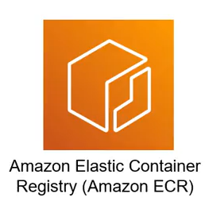

# 6. ECR (Elastic Container Registry) Overview

<p align="center">
  
</p>

## I. Giới thiệu Elastic Container Registry

**Amazon Elastic Container Registry (ECR)** là một dịch vụ lưu trữ container registry được quản lý hoàn toàn bởi AWS, cung cấp khả năng quản lý, bảo mật và lưu trữ các Docker Image. 

ECR là một Container Registry dựa trên điện toán đám mây (cloud-based), được thiết kế đặc biệt để làm việc mượt mà với các dịch vụ container khác của AWS như Amazon ECS (Elastic Container Service), Amazon EKS (Elastic Kubernetes Service), và AWS Fargate, giúp đơn giản hóa quy trình từ phát triển đến triển khai ứng dụng.

---

## II. Các khái niệm cốt lõi trong Amazon ECR

Để làm việc với ECR, bạn cần nắm vững hai thành phần cơ bản sau:

### 1. Registry (Kho chứa)
<p align="left">
  
</p>

* **Khái niệm:** Registry đóng vai trò là đơn vị quản lý chính của ECR (tương tự như một Repository trên Docker Hub hoặc GitHub). 
* **Vai trò:** Mỗi Registry được tạo ra để lưu trữ và quản lý các Docker Image của một ứng dụng cụ thể. Bạn có thể phân quyền truy cập (IAM Policies) chi tiết cho từng Registry để kiểm soát ai có quyền push hoặc pull image.

### 2. Image (Ảnh Container)
<p align="left">
  
</p>

* **Khái niệm:** Tương tự như các Docker Image thông thường được build từ Dockerfile.
* **Quản lý:** Các Image khi được đẩy lên Registry cần được đánh tag (ví dụ: `v1.0`, `latest`, `production`) để dễ dàng quản lý phiên bản, kiểm soát lịch sử và phục vụ việc rolling update ứng dụng trên môi trường chạy container.

---

## III. Quy trình làm việc cơ bản với Amazon ECR

Để đẩy một custom Docker image lên Amazon ECR, bạn sẽ trải qua quy trình 4 bước tiêu chuẩn sau:

> [!NOTE]
> ### 1. Tạo Repository trên ECR
> Bạn cần khởi tạo một repository trên AWS ECR Console hoặc thông qua AWS CLI để làm đích đến cho image:
> ```bash
> aws ecr create-repository --repository-name my-httpd --region ap-southeast-1
> ```

> [!IMPORTANT]
> ### 2. Đăng nhập Docker vào ECR Registry
> Xác thực Docker client cục bộ của bạn với ECR Registry của AWS (thay thế `<account-id>` bằng AWS Account ID của bạn):
> ```bash
> aws ecr get-login-password --region ap-southeast-1 | docker login --username AWS --password-stdin <account-id>.dkr.ecr.ap-southeast-1.amazonaws.com
> ```

> [!TIP]
> ### 3. Gắn Tag ECR cho Image cục bộ
> Docker Image cục bộ của bạn cần được gắn tag khớp với URI của repository trên ECR:
> ```bash
> # Build image cục bộ
> docker build -t my-httpd .
> 
> # Gắn tag trỏ tới ECR
> docker tag my-httpd:latest <account-id>.dkr.ecr.ap-southeast-1.amazonaws.com/my-httpd:latest
> ```

> [!WARNING]
> ### 4. Đẩy Image lên ECR (Push Image)
> Thực hiện đẩy image đã gắn tag lên đám mây AWS ECR:
> ```bash
> docker push <account-id>.dkr.ecr.ap-southeast-1.amazonaws.com/my-httpd:latest
> ```
