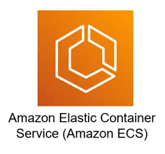
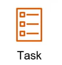
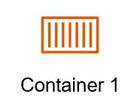
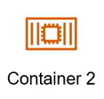

# 7. ECS (Elastic Container Service) Overview

  

## I. Giới thiệu Elastic Container Service (ECS)

**Amazon Elastic Container Service (ECS)** là một dịch vụ quản lý container đám mây (container orchestration) hiệu năng cao, bảo mật và được quản lý hoàn toàn bởi Amazon Web Services (AWS). Nó cho phép bạn dễ dàng chạy, dừng, mở rộng và quản lý các ứng dụng container hóa (Docker containers) trên nền tảng AWS một cách hiệu quả và linh hoạt.

---

## II. Các tính năng nổi bật của ECS

ECS cung cấp một bộ tính năng mạnh mẽ để đơn giản hóa vận hành hệ thống container:

* **Quản lý đơn giản:** Bạn không cần phải tự thiết lập, vận hành và quản lý các cụm điều phối container (như Kubernetes cluster), giảm thiểu đáng kể chi phí vận hành hạ tầng.
* **Tích hợp với công cụ container:** ECS tích hợp chặt chẽ với Docker. Bạn có thể định nghĩa và chạy các container Docker trực tiếp trên AWS mà không cần phải chỉnh sửa mã nguồn hay cấu hình ứng dụng.
* **Mở rộng linh hoạt (Auto Scaling):** Kết hợp chặt chẽ với **AWS Application Auto Scaling**, ECS cho phép tự động scale in/out (tăng/giảm) số lượng container đang hoạt động một cách linh hoạt dựa trên nhu cầu thực tế của workload (như CPU, Memory, Request Count).
* **Tích hợp sâu với các dịch vụ AWS khác:** ECS kết nối trực tiếp với:
  - **Elastic Load Balancing (ELB):** Phân phối traffic đến các container.
  - **Elastic Container Registry (ECR):** Kho lưu trữ Docker image an toàn.
  - **AWS IAM:** Phân quyền chi tiết cho từng container.
  - **Amazon CloudWatch:** Giám sát hiệu năng và thu thập logs tập trung.
* **Sự linh hoạt về kiến trúc (Launch Types):** ECS hỗ trợ hai chế độ chạy hạ tầng phù hợp với nhiều nhu cầu dự án:
  - **EC2 Launch Type:** Bạn quản lý và tối ưu hóa cụm máy chủ ảo EC2 chạy container.
  - **Fargate Launch Type (Serverless):** AWS tự động quản lý và cung cấp tài nguyên máy chủ. Bạn chỉ cần trả tiền cho CPU/RAM mà container thực sự sử dụng.

---

## III. Các thành phần cốt lõi của ECS (ECS Components)

Một kiến trúc Amazon ECS hoàn chỉnh được cấu thành từ các thành phần cơ bản sau:

| Thành phần | Icon | Mô tả chi tiết |
|:---|:---:|:---|
| **Cluster (Cụm)** | - | Đơn vị quản lý cao nhất của ECS. Cluster chịu trách nhiệm quản lý nhóm tài nguyên tính toán cần thiết (các máy chủ EC2 hoặc hạ tầng Serverless Fargate) để chạy ứng dụng của bạn. |
| **Task Definition** | *(JSON)* | Bản chỉ dẫn cấu hình dạng JSON. Đây là "bản thiết kế" (blueprint) khai báo chi tiết cách cấu hình một Task (sử dụng image nào từ ECR, cấp phát bao nhiêu CPU/RAM, biến môi trường, port mapping, v.v.). |
| **Task (Nhiệm vụ)** |  | Một đơn vị thực thi được cấp phát tài nguyên (CPU, RAM) cụ thể. Một Task là một thực thể chạy thực tế từ Task Definition và có thể chứa **một hoặc nhiều container** chạy liên kết chặt chẽ với nhau. |
| **Container** | 

 | Tương tự như Docker Container thông thường. Đây là một runnable instance của Docker Image chạy độc lập bên trong Task. |
| **Service (Dịch vụ)** |  | Một cơ chế giám sát và chạy một nhóm các Task có cùng chung nhiệm vụ. Service giúp duy trì số lượng Task chạy ổn định, tự động thay thế Task lỗi, tích hợp Load Balancer để expose dịch vụ ra ngoài hoặc nội bộ Cluster. |
| **ECS Service Connect** |  | Cung cấp cơ chế giao tiếp trực tiếp giữa các service (service-to-service communication) trong mạng dịch vụ một cách đơn giản, an toàn và có khả năng tự động khám phá dịch vụ (service discovery) mà không cần cấu hình ELB phức tạp. |

---

## IV. Quy trình khởi đầu cơ bản với ECS

> [!NOTE]
> ### Bước 1: Tạo Cluster (Cụm)
> Khởi tạo một ECS Cluster trên AWS Console (chọn chạy trên EC2 hoặc chế độ Serverless Fargate).

> [!IMPORTANT]
> ### Bước 2: Tạo Task Definition
> Tạo bản thiết kế ứng dụng. Khai báo image (ví dụ lấy từ repository ECR `my-httpd` bạn đã push ở bài học trước) và map cổng `80` của container.

> [!TIP]
> ### Bước 3: Tạo Service hoặc Chạy Task
> * **Service:** Sử dụng để chạy các ứng dụng chạy liên tục (như web server), tự động restart container nếu bị lỗi và tích hợp với Application Load Balancer (ALB).
> * **Run Task:** Sử dụng cho các tác vụ chạy một lần (như cron job, xử lý dữ liệu).
