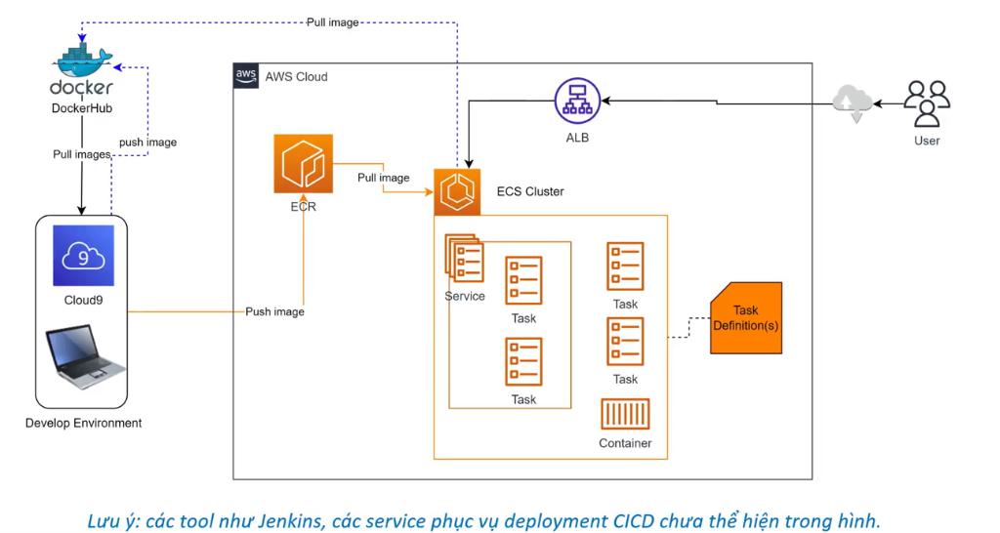

# 8. Sample hệ thống triển khai lên ECS và ECR

Sơ đồ dưới đây mô phỏng một kiến trúc triển khai ứng dụng thực tế sử dụng các dịch vụ Container của AWS bao gồm **Amazon ECR** và **Amazon ECS** kết hợp với bộ cân bằng tải **Application Load Balancer (ALB)**.

  

---

## I. Phân tích luồng hoạt động hệ thống

Kiến trúc triển khai trên được chia thành hai luồng xử lý chính: **Luồng Phát triển (CI/CD)** và **Luồng Vận hành (Runtime)**.

### 1. Luồng Phát triển & Đóng gói (Develop Environment)
* **Môi trường phát triển:** Lập trình viên làm việc trên môi trường phát triển (ví dụ: máy tính cá nhân hoặc môi trường IDE đám mây **AWS Cloud9**).
* **Kéo Base Image:** Hệ thống kéo (pull) các base image cần thiết từ các public registry như **Docker Hub** về môi trường phát triển.
* **Build & Đóng gói:** Dockerfile được biên dịch thành Docker Image hoàn chỉnh chứa mã nguồn ứng dụng.
* **Đẩy Image lên ECR:** Lập trình viên (hoặc công cụ CI/CD) thực hiện đăng nhập và đẩy (push) image lên kho lưu trữ private **Amazon ECR** để quản lý phiên bản.

### 2. Luồng Triển khai & Vận hành (AWS Cloud Cluster)
* **Kéo Image về Cluster:** Khi ứng dụng được kích hoạt khởi chạy hoặc cập nhật, **ECS Cluster** sẽ thực hiện kéo (pull) container image từ ECR Registry về.
* **Khởi tạo Task:** ECS Cluster dựa trên chỉ dẫn của **Task Definition(s)** để khởi tạo các **Task** (chứa các **Container** chạy mã nguồn của bạn).
* **Quản lý bằng Service:** **Service** của ECS giám sát các Task này, đảm bảo chúng luôn chạy ổn định và tự động thay thế Task mới nếu có lỗi xảy ra.
* **Định tuyến người dùng (ALB):** 
  - Người dùng truy cập ứng dụng qua internet.
  - Yêu cầu đi qua cổng mạng đám mây và được tiếp nhận bởi **Application Load Balancer (ALB)**.
  - ALB thực hiện kiểm tra sức khỏe (Health Check) và phân phối đều lưu lượng truy cập đến các cổng dịch vụ của các **Task** đang hoạt động tốt bên trong ECS Cluster.

---

## II. Các thành phần tham gia trong sơ đồ

| Thành phần | Vai trò trong hệ thống |
|:---|:---|
| **Develop Environment (Cloud9)** | Nơi viết code, build Docker image từ Dockerfile và đẩy lên kho chứa đám mây. |
| **Amazon ECR** | Kho chứa Private Registry lưu trữ Docker image an toàn, sẵn sàng phục vụ ECS Cluster. |
| **ECS Cluster** | Hạ tầng chạy ứng dụng (sử dụng EC2 instances hoặc serverless AWS Fargate). |
| **Task Definition** | File cấu hình (blueprint) khai báo image, port, tài nguyên cho Task. |
| **Task / Container** | Thực thể ứng dụng đang chạy thực tế, phục vụ người dùng. |
| **Application Load Balancer (ALB)** | Cổng phân phối tải đầu vào, giúp hệ thống chịu tải tốt và tăng tính sẵn sàng (High Availability). |

> [!IMPORTANT]
> **Lưu ý:**
> Sơ đồ trên tập trung minh họa luồng cấu trúc hạ tầng cơ bản. Trong môi trường thực tế, các công cụ CI/CD tự động như **Jenkins**, **GitHub Actions**, **GitLab CI** hoặc **AWS CodePipeline** sẽ tự động hóa luồng phát triển (tự động build, chạy test, push image lên ECR và ra lệnh update ECS service) thay vì thực hiện thủ công từ môi trường Cloud9.
