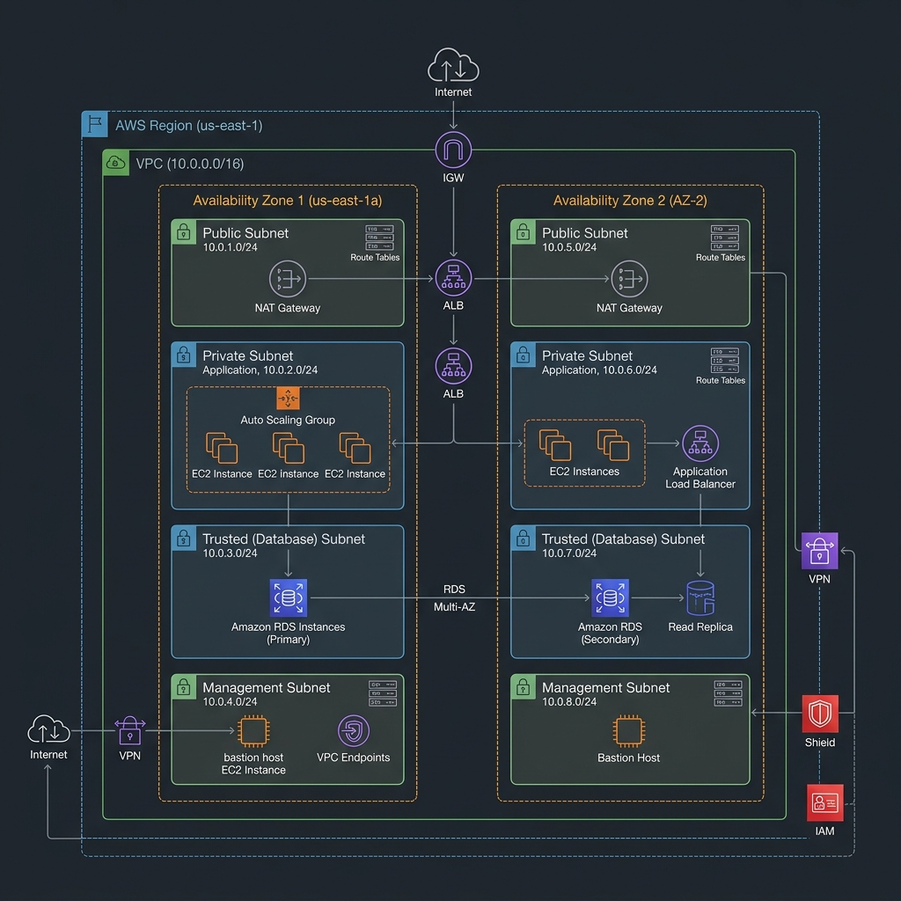
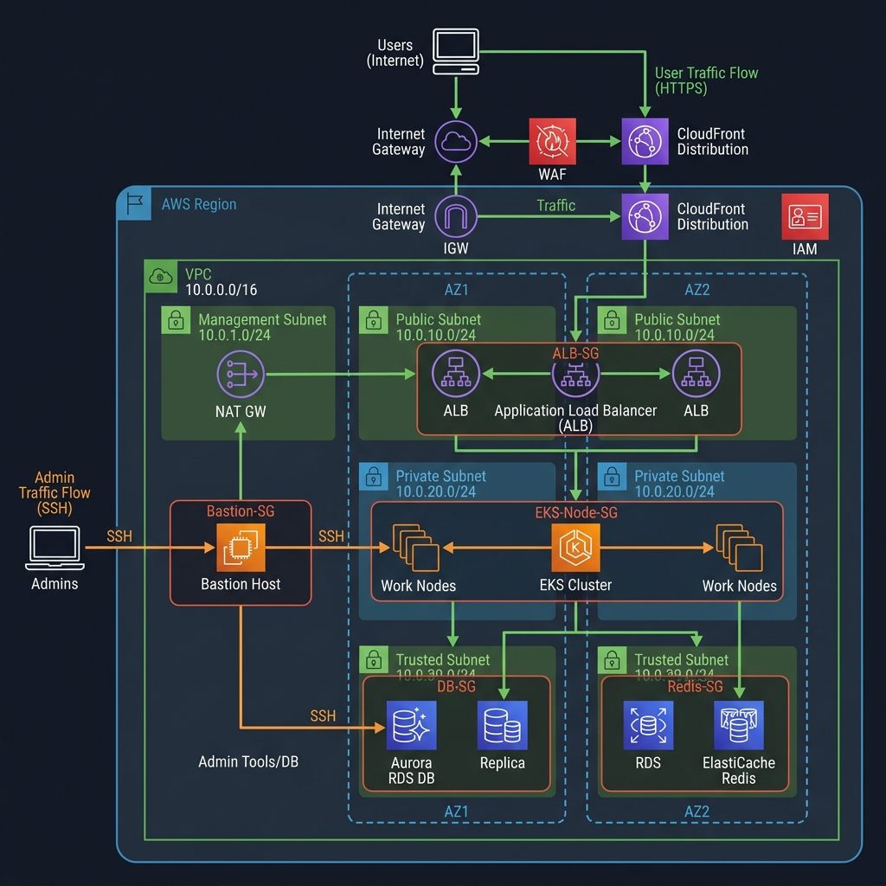

# 14. Mô hình VPC với 4 loại Subnet thông dụng (Enterprise VPC Architecture)

Trong các dự án thực tế quy mô doanh nghiệp (Enterprise), việc chia VPC thành 2 loại subnet cơ bản (Public và Private) thường không đủ để đáp ứng các tiêu chuẩn bảo mật khắt khe như **PCI-DSS**, **ISO 27001** hoặc nguyên tắc **Least Privilege** (Quyền hạn tối thiểu). 

Vì vậy, mô hình VPC chuẩn thường được phân tách thành **4 loại Subnet chuyên biệt** nhằm phân ranh giới bảo mật rõ ràng cho từng lớp kiến trúc ứng dụng.

---

## I. Sơ đồ kiến trúc phân hoạch mạng (Network Topology)

Sơ đồ dưới đây mô tả cách phân hoạch dải IP chính **`10.0.0.0/16`** thành 4 nhóm subnet trên 2 Availability Zones (`AZ-1` và `AZ-2`) để đảm bảo tính sẵn sàng cao (High Availability - HA).

### 1. Phân bổ dải IP CIDR chi tiết cho từng Subnet

| Availability Zone | Subnet Type | Tên Subnet | Dải CIDR | Số lượng IP khả dụng |
| :--- | :--- | :--- | :--- | :--- |
| **AZ - 1** | Public | `public-subnet-1` | `10.0.1.0/24` | 251 |
| **AZ - 2** | Public | `public-subnet-2` | `10.0.2.0/24` | 251 |
| **AZ - 1** | Private | `private-subnet-1` | `10.0.3.0/24` | 251 |
| **AZ - 2** | Private | `private-subnet-2` | `10.0.4.0/24` | 251 |
| **AZ - 1** | Trusted (Database) | `trusted-subnet-1` | `10.0.5.0/24` | 251 |
| **AZ - 2** | Trusted (Database) | `trusted-subnet-2` | `10.0.6.0/24` | 251 |
| **AZ - 1** | Management | `mgmt-subnet-1` | `10.0.7.0/24` | 251 |
| **AZ - 2** | Management | `mgmt-subnet-2` | `10.0.8.0/24` | 251 |

> [!NOTE]
> *Công thức tính IP khả dụng thực tế:* Lấy tổng số IP của dải `/24` ($256$ IP) trừ đi $5$ địa chỉ IP bị AWS giữ lại để cấu hình hệ thống (như Router, DNS, DHCP, Network Link...).

---

## II. Phân tích chi tiết 4 loại Subnet thông dụng

### 1. Public Subnet (Mạng con công khai)
*   **Bản chất:** Bảng định tuyến (`public-rtb`) có tuyến đường trỏ trực tiếp dải `0.0.0.0/0` về **Internet Gateway (IGW)**.
*   **Nhiệm vụ:**
    *   Chứa các tài nguyên cần giao tiếp trực tiếp với môi trường ngoài (Internet).
    *   Chứa **Application Load Balancer (ALB)** để tiếp nhận traffic người dùng.
    *   Chứa các cổng dịch vụ NAT (**NAT Gateway**) để trung chuyển internet một chiều ra ngoài cho Private Subnet.
*   **Mức độ bảo mật:** Thấp nhất trong VPC (Front-facing).

### 2. Private Subnet (Mạng con ứng dụng / nội bộ)
*   **Bản chất:** Bảng định tuyến (`private-rtb`) có tuyến đường trỏ `0.0.0.0/0` qua **NAT Gateway** (nằm ở Public Subnet) để đi ra ngoài internet một chiều (ví dụ: tải thư viện code, cập nhật bản vá OS). Hoàn toàn không cho phép bất cứ kết nối trực tiếp nào đi từ Internet vào.
*   **Nhiệm vụ:**
    *   Chứa máy chủ ứng dụng chính (Application Layer) như các cụm **Kubernetes (EKS)**, EC2 instances chạy Service, ECS container, v.v.
*   **Mức độ bảo mật:** Trung bình - Cao.

### 3. Trusted Subnet / DB Subnet (Mạng con tin cậy / Cơ sở dữ liệu)
*   **Bản chất:** Bảng định tuyến (`trusted-rtb`) **hoàn toàn cô lập**. Không trỏ ra Internet Gateway, cũng không trỏ qua NAT Gateway. Mọi luồng dữ liệu ra/vào subnet này chỉ giới hạn cục bộ (local routing) trong nội bộ VPC.
*   **Nhiệm vụ:**
    *   Nơi lưu trữ tài sản nhạy cảm nhất của doanh nghiệp: Cơ sở dữ liệu (**RDS PostgreSQL, MySQL**), Bộ nhớ đệm caching (**ElastiCache Redis, Memcached**).
    *   Việc cô lập hoàn toàn giúp DB tránh được mọi rủi ro tấn công mạng từ Internet (ngay cả khi NAT Gateway bị cấu hình sai hoặc bị tấn công).
*   **Mức độ bảo mật:** Cực kỳ cao (Isolated).

### 4. Management Subnet (Mạng con quản trị)
*   **Bản chất:** Bảng định tuyến (`mgmt-rtb`) có thể trỏ về Internet Gateway (nếu quản trị viên truy cập từ xa qua SSH trên Bastion Host sử dụng Elastic IP) hoặc kết nối qua VPN Gateway / Transit Gateway để đồng bộ với mạng On-Premises của công ty.
*   **Nhiệm vụ:**
    *   Chứa các máy chủ nhảy (**Bastion Host / Jump Box**), máy chủ CI/CD runners (Jenkins, GitLab Runners), các công cụ giám sát (Monitoring) và quản trị hệ thống.
    *   Tách biệt tài nguyên quản trị ra khỏi luồng ứng dụng chính giúp dễ dàng quản lý quyền hạn của vận hành viên và giảm thiểu rủi ro bảo mật.
*   **Mức độ bảo mật:** Cao (Chỉ mở cổng truy cập giới hạn theo IP nguồn).

---

## III. Sơ đồ luồng dữ liệu & Phân quyền Security Groups

Sơ đồ dưới đây mô tả chi tiết cách dữ liệu di chuyển từ ngoài Internet qua các lớp bảo mật để tới ứng dụng và cơ sở dữ liệu, kết hợp với cơ chế phân quyền an toàn giữa các nhóm bảo mật (Security Group Chaining):

### 1. Luồng truy cập của người dùng (Application Traffic Flow)
1.  **Người dùng (Client)** kết nối từ Internet đi qua **WAF (Web Application Firewall)** để lọc các cuộc tấn công phổ biến (SQL Injection, XSS...).
2.  Traffic được chuyển tới **CloudFront (CDN)** để tăng tốc phân phối nội dung tĩnh (ảnh, video lấy từ S3 thông qua cơ chế OAI an toàn) và chuyển tiếp nội dung động (API) tới ứng dụng.
3.  Yêu cầu HTTPS được gửi vào **Application Load Balancer (ALB)** đặt tại **Public Subnet** (gán nhóm `public-sg` mở cổng `443` cho internet).
4.  ALB giải mã SSL và điều hướng HTTP (cổng `80`) vào các Worker Nodes của cụm **Kubernetes (EKS)** đặt tại **Private Subnet** (gán nhóm `app-sg`).
5.  Ứng dụng EKS xử lý logic và truy vấn cơ sở dữ liệu **PostgreSQL** (cổng `5432`) hoặc lưu trữ đệm **Redis** (cổng `6379`) đặt tại **Trusted Subnet** (gán nhóm `db-sg`).

### 2. Luồng quản trị hệ thống (Management Traffic Flow)
*   Quản trị viên (Admin/Operator) từ Home/Company kết nối thông qua giao thức **SSH** (cổng `22`) tới **Bastion Host** đặt tại **Management Subnet** (gán nhóm `mgmt-sg`).
*   Bastion Host có cấu hình Elastic IP công cộng và chỉ chấp nhận kết nối SSH từ một số IP tĩnh (IP Whitelist) của văn phòng công ty hoặc dải IP mạng VPN riêng của doanh nghiệp.
*   Từ Bastion Host, quản trị viên có thể kết nối SSH sang cụm EKS (Private Subnet) hoặc kết nối client quản trị Database (cổng `5432` tới Trusted Subnet) để thực hiện bảo trì, vận hành.

---

## IV. Thiết lập Security Group Chaining cho mô hình 4 Subnet

Để hiện thực hóa sơ đồ trên, các quy tắc Inbound (nhận dữ liệu vào) của từng Security Group được xâu chuỗi chặt chẽ với nhau:

| Security Group | Quy tắc Inbound (Quy định chiều vào) | Ý nghĩa bảo mật |
| :--- | :--- | :--- |
| **`public-sg`** *(ALB)* | Mở cổng `HTTPS:443` từ `0.0.0.0/0` (hoặc giới hạn theo dải IP CloudFront). | Tiếp nhận lưu lượng người dùng từ Internet. |
| **`app-sg`** *(EKS)* | 1. Mở cổng `HTTP:80` từ **`public-sg`**. 2. Mở cổng `SSH:22` từ **`mgmt-sg`**. | 1. Chỉ nhận request đã qua bộ cân bằng tải ALB. 2. Chỉ nhận lệnh SSH từ máy chủ quản trị. |
| **`db-sg`** *(Database)* | 1. Mở cổng `TCP:5432` (PostgreSQL) và `TCP:6379` (Redis) từ **`app-sg`**. 2. Mở cổng `TCP:5432` từ **`mgmt-sg`**. | 1. Chỉ cho phép các ứng dụng thuộc cụm EKS truy vấn dữ liệu. 2. Chỉ cho phép quản trị viên từ Bastion Host kết nối vào để bảo trì dữ liệu. |
| **`mgmt-sg`** *(Bastion)* | Mở cổng `SSH:22` từ IP cụ thể của Admin/Doanh nghiệp. | Chỉ cho phép người vận hành được ủy quyền từ địa chỉ IP tin cậy kết nối SSH vào. |

---

## V. Sử dụng VPC Endpoints để tăng cường bảo mật

Ở phần dưới cùng của sơ đồ mạng có sự xuất hiện của **VPC Endpoints**:
*   **VPC Endpoint** (như S3 Gateway Endpoint, SSM Interface Endpoint...) cho phép các tài nguyên chạy trong Private Subnets, Trusted Subnets và Management Subnets có thể kết nối an toàn với các dịch vụ AWS khác mà **không cần đi qua NAT Gateway và không cần tiếp xúc với Internet công cộng**.
*   Điều này giúp tiết kiệm đáng kể chi phí xử lý dữ liệu của NAT Gateway (Data Processing charge) và nâng cao hiệu năng đường truyền đáng kể.

---

*   **Bài trước:** [13. Lab 3 – Test kết nối trên VPC đã tạo (VPC Hands-on Lab)](13. Lab 3 - Test Connection on Created VPC.md)
*   **Bài tiếp theo:** [15. VPC - Các tùy chọn nâng cao](15. VPC - Advanced Networking Options.md)

