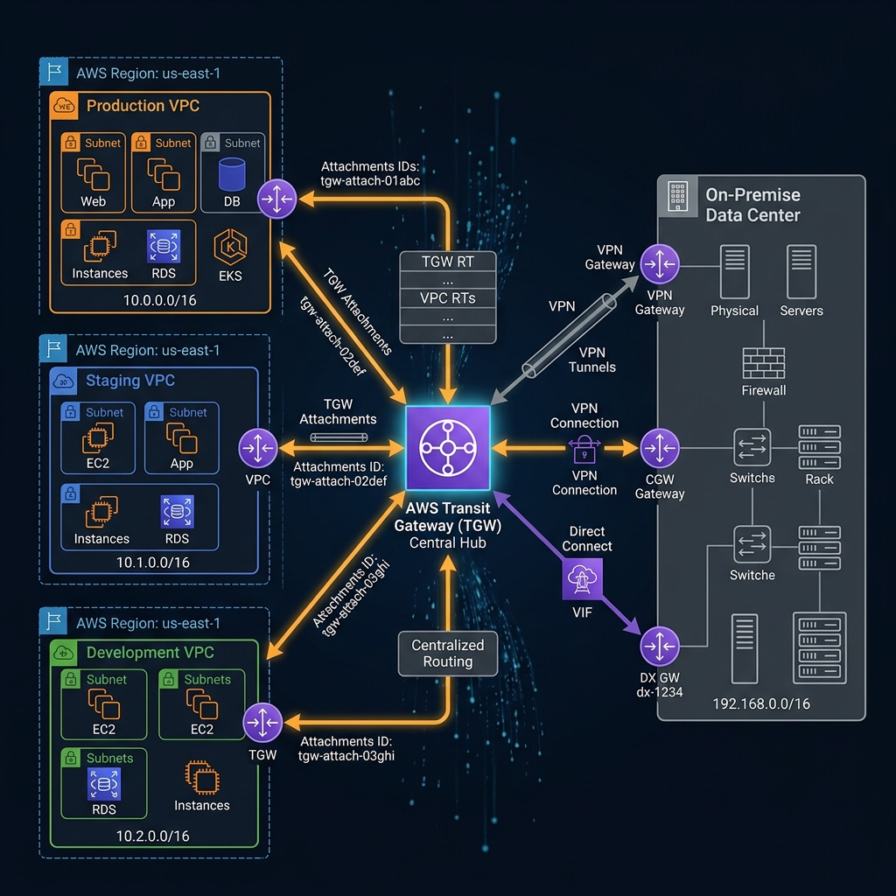
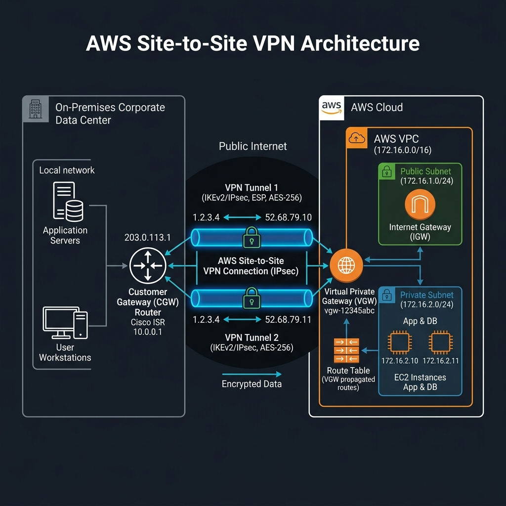
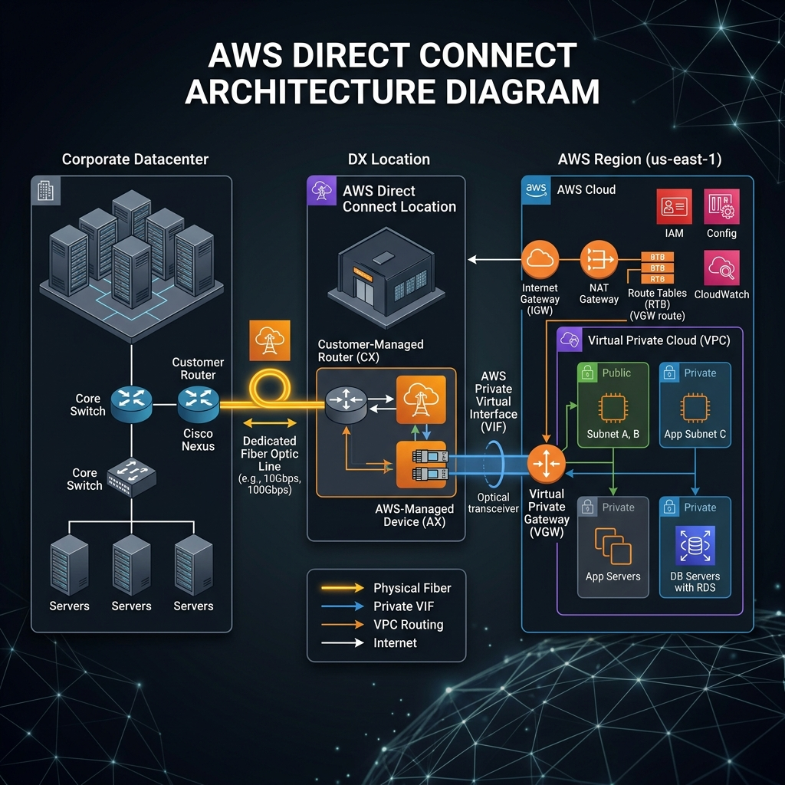
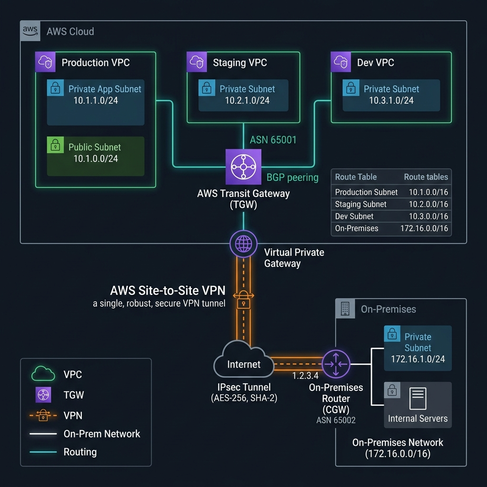

# 15. VPC - Các tùy chọn nâng cao (Advanced Networking Options)

Khi quy mô hệ thống doanh nghiệp mở rộng, việc vận hành đơn lẻ một VPC duy nhất không còn đáp ứng được nhu cầu thực tế. Doanh nghiệp cần kết nối nhiều VPC lại với nhau (ví dụ: VPC cho môi trường Production, Staging, Development riêng biệt) hoặc kết nối tài nguyên trên đám mây AWS với hệ thống máy chủ vật trị tại văn phòng/trung tâm dữ liệu truyền thống (On-Premises).

AWS cung cấp các giải pháp kết nối mạng nâng cao bao gồm: **VPC Peering**, **Transit Gateway**, **Site-to-Site VPN** và **Direct Connect**.

---

## I. VPC Peering (Kết nối ngang hàng)

**VPC Peering** là hình thức kết nối trực tiếp đơn giản nhất giữa 2 VPC trên AWS. Thông qua Peering Connection, các tài nguyên ở 2 VPC có thể giao tiếp với nhau bằng địa chỉ **IP Private** mà không cần đi qua Internet công cộng, đảm bảo độ trễ thấp và độ bảo mật cao.

### 1. Đặc điểm cốt lõi của VPC Peering
*   **Phạm vi kết nối:** 2 VPC có thể thuộc cùng một tài khoản AWS (same account) hoặc nằm ở hai tài khoản AWS khác nhau (cross-account). Chúng cũng có thể nằm ở cùng một Region hoặc khác Region khác nhau (Inter-Region VPC Peering).
*   **Quy trình thiết lập:** 
    *   Phía chủ động gửi yêu cầu kết nối gọi là **Requester**.
    *   Phía tiếp nhận yêu cầu kết nối gọi là **Accepter** (phải nhấn Accept để thiết lập quan hệ kết nối).
*   **Điều kiện tiên quyết:** 2 VPC muốn thực hiện peering bắt buộc phải có **dải IP CIDR không được trùng lặp hoặc chồng chéo lên nhau (non-overlapping)**.
*   **Cấu hình bắt buộc sau khi thiết lập:**
    *   **Route Table:** Cần thêm một tuyến đường (route) mới trỏ dải IP của VPC đối tác đi qua cổng kết nối Peering (`pcx-xxxxxx`).
    *   **Security Group:** Cấu hình mở cổng thích hợp cho phép IP Private hoặc Security Group của VPC đối tác truy cập vào tài nguyên.

### 2. Tính chất không bắc cầu (Non-transitive Routing)
VPC Peering có tính chất **không bắc cầu (non-transitive)**. 
> [!WARNING]
> Nếu VPC-A đã peer với VPC-B, và VPC-B đã peer với VPC-C, thì **VPC-A KHÔNG THỂ giao tiếp trực tiếp với VPC-C** qua VPC-B.
> Nếu muốn VPC-A kết nối được với VPC-C, bạn bắt buộc phải tạo một Peering Connection trực tiếp giữa VPC-A và VPC-C.

---

## II. AWS Transit Gateway (Bộ trung chuyển mạng trung tâm)

Khi số lượng VPC và kết nối mạng On-Premises tăng lên (hàng chục đến hàng trăm kết nối), việc thiết lập kết nối ngang hàng (VPC Peering) thủ công giữa từng cặp VPC sẽ tạo nên một ma trận mạng cực kỳ phức tạp và rất khó quản lý. 

**AWS Transit Gateway** ra đời để giải quyết bài toán này, đóng vai trò như một **Hub trung chuyển trung tâm** (Cloud Router) để điều phối và định tuyến toàn bộ lưu lượng dữ liệu giữa các VPC và hệ thống mạng On-Premises của doanh nghiệp.

### Đặc điểm của Transit Gateway:
*   **Kiến trúc Hub-and-Spoke:** Chỉ cần kết nối các VPC và kết nối VPN/Direct Connect trực tiếp vào Transit Gateway. Transit Gateway sẽ tự động xử lý định tuyến giữa các điểm này.
*   **Đơn giản hóa quản trị:** Quản lý tập trung các bảng định tuyến (Route Tables) tại một nơi duy nhất thay vì cấu hình rải rác ở từng VPC.
*   **Khả năng mở rộng:** Dễ dàng kết nối thêm hàng nghìn VPC hoặc mạng nhánh mới mà không làm phức tạp hóa cấu trúc mạng hiện tại.
*   **Kết hợp linh hoạt:** Thường được sử dụng kết hợp với các kết nối từ On-Premises như **Site-to-Site VPN** hoặc **Direct Connect** để tạo thành mạng WAN doanh nghiệp đồng bộ.

---

## III. AWS Site-to-Site VPN (Kết nối mạng bảo mật qua Internet)

**AWS Site-to-Site VPN** là giải pháp kết nối mạng an toàn giữa hệ thống dữ liệu tại văn phòng/nhà máy (On-Premises) với VPC trên AWS Cloud thông qua môi trường Internet công cộng.

### 1. Các thành phần chính của VPN
*   **Virtual Private Gateway (VGW) / Transit Gateway:** Cổng kết nối nằm ở phía AWS để tiếp nhận lưu lượng VPN.
*   **Customer Gateway (CGW):** Thiết bị định tuyến vật lý (Router/Firewall như Cisco, Fortinet...) hoặc thiết bị ảo đặt tại phòng Server của On-Premises để chịu trách nhiệm thiết lập và duy trì kết nối VPN với AWS.

### 2. Đặc điểm kỹ thuật
*   **Bảo mật:** Toàn bộ lưu lượng dữ liệu truyền đi giữa On-Premises và AWS Cloud đều được **mã hóa an toàn** bằng giao thức **IPsec (IP Security)** bảo vệ thông tin không bị đánh cắp trên môi trường Internet.
*   **Băng thông (Bandwidth):** Băng thông tối đa của 1 đường truyền (Tunnel) VPN là khoảng **1.25 Gbps**. Khi kết hợp nhiều đường truyền bằng kỹ thuật **ECMP (Equal-Cost Multi-Path)** trên Transit Gateway, băng thông tổng thể có thể đạt tới mức **~4 Gbps**.
*   **Chi phí:** Rẻ, dễ cài đặt và triển khai nhanh chóng vì tận dụng đường truyền Internet sẵn có.
*   **Độ ổn định:** Phụ thuộc vào chất lượng đường truyền Internet của nhà mạng (độ trễ có thể dao động).

---

## IV. AWS Direct Connect (Kết nối vật lý chuyên dụng)

Đối với các ứng dụng doanh nghiệp lớn yêu cầu sự ổn định tuyệt đối về băng thông, độ trễ cực thấp và bảo mật tối đa, việc truyền dữ liệu qua mạng Internet công cộng (VPN) là không đủ. 

**AWS Direct Connect (DX)** cung cấp một đường cáp vật lý chuyên dụng nối trực tiếp từ Trung tâm dữ liệu của doanh nghiệp (hoặc nhà cung cấp dịch vụ mạng đối tác) đến cơ sở hạ tầng của AWS mà **không đi qua môi trường Internet công cộng**.

### Đặc điểm kỹ thuật của Direct Connect:
*   **Kết nối vật lý riêng biệt:** Dữ liệu di chuyển trên hạ tầng cáp quang chuyên dụng riêng, đem lại độ trễ cực thấp (Low Latency) và triệt tiêu hoàn toàn rủi ro nghẽn mạng do đứt cáp quang biển công cộng.
*   **Băng thông vượt trội:** Băng thông rất lớn và ổn định, dao động linh hoạt từ **50 Mbps đến 100 Gbps**.
*   **Không mã hóa mặc định (By default, not encrypted):** Vì dữ liệu đi trên đường truyền vật lý riêng biệt và an toàn, AWS mặc định **không thực hiện mã hóa dữ liệu** trên Direct Connect (để đạt tốc độ truyền tải tối đa). Nếu doanh nghiệp có nhu cầu bảo mật tuyệt đối, có thể cấu hình thêm giao thức mã hóa **MACsec (IEEE 802.1AE)** hoặc thiết lập một đường truyền **VPN chồng lên trên Direct Connect**.
*   **Triển khai phức tạp:** Khó cài đặt hơn nhiều so với VPN, mất nhiều thời gian cấu hình và cần làm việc trực tiếp với nhà cung cấp hạ tầng viễn thông đối tác của AWS (Direct Connect Partners) tại địa phương để kéo cáp vật lý.

---

## V. Kết nối phối hợp: Transit Gateway với VPN

Mô hình nâng cao phổ biến nhất trong thực tế là kết nối nhiều VPC trên AWS với chi nhánh On-Premises thông qua Transit Gateway và một đường truyền VPN bảo mật duy nhất.

Kiến trúc này giúp doanh nghiệp tận dụng tối đa khả năng mở rộng của Transit Gateway để quản lý tập trung và phân phối lưu lượng định tuyến về On-Premises qua cổng Customer Gateway mà không cần cấu hình VPN riêng lẻ cho từng VPC.

---

## VI. Bảng so sánh tổng hợp các giải pháp kết nối mạng nâng cao

| Tiêu chí so sánh | VPC Peering | Transit Gateway | Site-to-Site VPN | Direct Connect |
| :--- | :--- | :--- | :--- | :--- |
| **Mục đích kết nối** | VPC $\leftrightarrow$ VPC | Trung tâm điều phối đa kết nối | On-Premise $\leftrightarrow$ AWS | On-Premise $\leftrightarrow$ AWS |
| **Đường truyền vật lý** | Hạ tầng mạng AWS | Hạ tầng mạng AWS | Internet công cộng | Kênh truyền vật lý riêng |
| **Trùng lặp dải IP** | Không được trùng lặp | Không được trùng lặp | Không được trùng lặp | Không được trùng lặp |
| **Mã hóa dữ liệu** | Không cần (đi nội bộ AWS) | Không cần (đi nội bộ AWS) | **Có** (Mã hóa IPsec) | **Không mặc định** (Cần MACsec) |
| **Độ trễ (Latency)** | Rất thấp | Thấp | Phụ thuộc internet | **Cực kỳ thấp & Ổn định** |
| **Băng thông (Bandwidth)** | Không giới hạn | Lên tới 50 Gbps/VPC | ~1.25 Gbps - 4 Gbps | **50 Mbps - 100 Gbps** |
| **Thời gian thiết lập** | Ngay lập tức | Vài phút | Vài phút | **Vài tuần đến vài tháng** |

---

*   **Bài trước:** [14. Mô hình VPC với 4 loại subnet thông dụng](14. VPC Model with 4 Common Subnets.md)
*   **Bài tiếp theo:** [9. EKS (Elastic Kubernetes Service)](../9. EKS.md)
