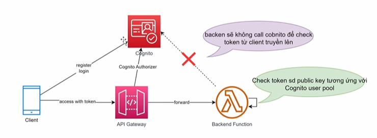

# Amazon Cognito Limits & Token Verification

Khi thiết kế và xây dựng kiến trúc hệ thống xác thực sử dụng AWS Cognito, có một số giới hạn kỹ thuật (Quotas/Limits) và cơ chế xác thực Token quan trọng cần được lưu ý để tránh các lỗi nghẽn cổ chai (bottleneck) hoặc các lỗ hổng bảo mật.

---

## 1. Các hạn chế và giới hạn mặc định của Cognito (Cognito Quotas)

Dưới đây là một số giới hạn (mặc định) khi làm việc với Cognito User Pools. Một số giới hạn có thể yêu cầu AWS nâng lên (Soft Limit), tuy nhiên có những giới hạn là cố định (Hard Limit).

### Giới hạn về tài nguyên:
- **Số lượng User tối đa trên 1 User Pool:** **40 triệu người dùng** (đây là soft limit, có thể liên hệ hỗ trợ AWS để yêu cầu nâng cấp thêm).
- **Số lượng User Pool tối đa trên một tài khoản:** Mặc định là **1.000 User Pools** (tối đa nâng được lên 10.000).
- **Custom Attributes (Thuộc tính tùy biến):** Tối đa **50 thuộc tính tùy biến** trên mỗi User Pool (đây là hard limit, không thể nâng thêm).

### Giới hạn về tần suất gọi Admin API (Admin API Rate Limits):
Các API quản trị thường có hạn mức tần suất gọi (Request Per Second - RPS) để tránh việc lạm dụng hoặc tấn công DDoS:
- **UserCreation (Tạo user - `AdminCreateUser`):** Mặc định **50 RPS**. Hỗ trợ tự động tăng thêm **10 RPS** cho mỗi 1 triệu người dùng hoạt động hàng tháng (MAU).
- **AdminUserRead (Đọc user - `AdminGetUser`):** Mặc định **120 RPS**. Hỗ trợ tự động tăng thêm **40 RPS** cho mỗi 1 triệu MAU.
- **RevokeToken (Hủy Token):** Mặc định **120 RPS**. Hỗ trợ tự động tăng thêm **40 RPS** cho mỗi 1 triệu MAU.
- **UserUpdate (Cập nhật user - `AdminUpdateUserAttributes`):** Giới hạn cứng **25 RPS** và **không thể yêu cầu tăng thêm**. Do đó, cần tránh thiết kế luồng cập nhật thông tin user Cognito liên tục theo thời gian thực (real-time).

---

## 2. Cơ chế xác thực Token của Cognito (Token Verification)

Cơ chế xác thực JSON Web Token (JWT) được phát hành bởi Cognito được tối ưu hóa để giảm độ trễ (latency) của hệ thống bằng cách thực hiện xác thực ở phía Client / Backend cục bộ (Offline Verification):

### Cách thức hoạt động:
1. **Đăng nhập & Nhận Token:** Client gửi yêu cầu đăng ký/đăng nhập tới **Amazon Cognito**. Sau khi thành công, Cognito trả về JWT token (bao gồm ID Token, Access Token và Refresh Token).
2. **Gửi request kèm Token:** Client gửi yêu cầu kèm Access Token trong header tới **AWS API Gateway**.
3. **Chuyển tiếp đến Backend:** API Gateway sử dụng Cognito Authorizer để kiểm tra cấu trúc token cơ bản rồi forward request xuống **Backend Function (Lambda)**.
4. **Xác thực cục bộ (Client-side / Local Verify):** 
   - Backend Lambda sẽ tự động tải các Public Key (JWKS) được công khai của Cognito User Pool tương ứng để giải mã và kiểm tra tính hợp lệ của token (chữ ký, thời gian hết hạn).
   - **Lưu ý quan trọng:** Backend Lambda **sẽ không thực hiện bất kỳ cuộc gọi API ngược lại Cognito** để kiểm tra trạng thái token. Điều này giúp giảm tải cho Cognito và tăng tốc độ xử lý của API. (Lưu ý: AWS không cung cấp Private Key của Cognito User Pool cho người dùng).

---

## 3. Vấn đề thu hồi Token (Token Revocation & Logout)

Chính vì cơ chế **xác thực cục bộ không gọi lại Cognito** như trên, hệ thống sẽ gặp phải một hạn chế lớn về mặt nghiệp vụ:

> [!WARNING]
> **Hạn chế thu hồi Access Token:**
> Khi người dùng thực hiện **Đăng xuất (Logout)** hoặc **Thay đổi mật khẩu (Change Password)**, Cognito có thể đánh dấu hủy token ở phía server của họ. Tuy nhiên, các Backend Function đang xác thực offline cục bộ bằng Public Key **vẫn sẽ chấp nhận Access Token cũ này** cho tới khi nó tự động hết hạn (ví dụ: thời gian sống mặc định là 30 phút hoặc 60 phút).

### Giải pháp khắc phục (Workarounds):
Nếu hệ thống của bạn yêu cầu thu hồi quyền truy cập của token ngay lập tức (Instant Revocation), bạn có thể áp dụng các kỹ thuật sau:
1. **Sử dụng Cache (Redis) / Database:** Khi user logout hoặc đổi mật khẩu, lưu ID của token hoặc thông tin user đó vào một danh sách đen (Blacklist) trên Redis có thời gian hết hạn bằng đúng thời gian sống của token. Mỗi khi Lambda nhận request, sẽ kiểm tra nhanh trên Redis xem token có nằm trong blacklist không trước khi xử lý.
2. **Sử dụng Lambda Authorizer:** Thay vì dùng Cognito Authorizer mặc định, tự viết một Custom Lambda Authorizer trên API Gateway để thực hiện gọi API `GetUser` hoặc `ListTokens` của Cognito để kiểm tra trạng thái hoạt động thực tế của token trước khi forward request (lưu ý giới hạn RPS của Cognito API).

---

*   **Bài trước:** [9. Chi phí và Bảng giá Cognito (Cognito Pricing)](9. Cognito Pricing.md)
*   **Bài tiếp theo:** [11. Lab 2 – Cognito Thao tác cơ bản (API Gateway & Cognito Hands-on Lab)](11. Lab 2 - Cognito Operation Basic.md)

