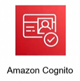

# Amazon Cognito Pricing

Chi phí sử dụng AWS Cognito được tính toán dựa trên khối lượng sử dụng thực tế và các tính năng kích hoạt bổ sung, không có phí khởi tạo cố định. Các yếu tố chính cấu thành giá bao gồm:

## 1. Số lượng người dùng hoạt động hàng tháng (Monthly Active Users - MAU)

Một người dùng được tính là hoạt động (Active) trong tháng nếu có bất kỳ hành động nào như: đăng ký mới, đăng nhập, đổi mật khẩu, hoặc cập nhật thuộc tính tài khoản.

- **Tài khoản User Pool cục bộ:**
  - Được miễn phí **50.000 MAU đầu tiên** mỗi tháng (Free Tier của Cognito).
  - Từ các MAU tiếp theo, chi phí được tính theo bậc lũy tiến (càng nhiều người dùng thì đơn giá càng rẻ).
  - *Ví dụ tại khu vực Singapore (ap-southeast-1):*
    - Tiếp theo từ 50.001 đến 100.000 MAU: **$0.0055 / MAU / tháng**.
    - Tiếp theo từ 100.001 đến 1.000.000 MAU: **$0.0046 / MAU / tháng**.

## 2. Xác thực qua SAML hoặc OIDC (Federated Users)

Đối với những người dùng đăng nhập bằng tài khoản doanh nghiệp thông qua các giao thức SAML 2.0 hoặc OpenID Connect (OIDC):
- Không áp dụng chương trình miễn phí (Free Tier).
- Chi phí được tính trên mỗi MAU của nhóm người dùng này.
- *Ví dụ tại Singapore:* **$0.015 / MAU / tháng**.

## 3. Tính năng bảo mật nâng cao (Advanced Security Features)

Nếu bạn bật tính năng Advanced Security để phân tích hành vi và ngăn chặn các mối đe dọa truy cập bất thường:
- Chi phí sẽ được cộng thêm trên mỗi MAU hoạt động trong tháng.
- *Đơn giá:* **$0.05 / MAU / tháng** nếu kích hoạt.

## 4. Chi phí gửi tin nhắn SMS

- Trong trường hợp bạn cấu hình gửi tin nhắn SMS để gửi mã xác thực OTP khi đăng ký hoặc xác thực đa yếu tố (MFA):
  - Chi phí sẽ được tính trên mỗi tin nhắn SMS gửi đi thành công.
  - *Đơn giá:* Tùy thuộc vào nhà mạng và quốc gia/khu vực nhận tin nhắn (AWS tính phí riêng theo bảng giá SMS của Amazon SNS).

---

*   **Bài trước:** [8. Giới thiệu về Cognito (Amazon Cognito)](8. Amazon Cognito.md)
*   **Bài tiếp theo:** [10. Giới hạn Cognito và Xác thực Token (Cognito Limits and Token Verification)](10. Cognito Limits and Token Verification.md)
