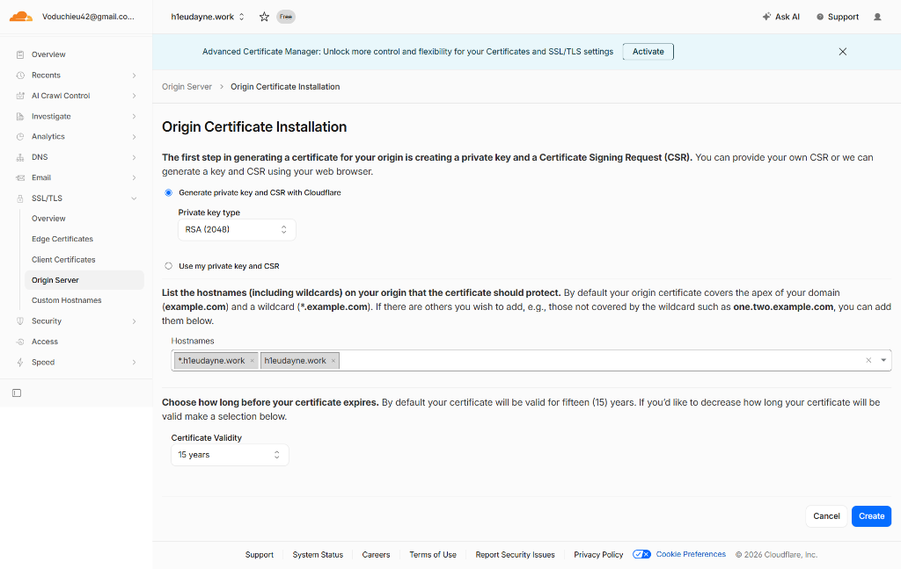

# Bài 5: Triển khai công cụ quản lý truy cập máy chủ (Teleport) trên Cloud AWS - EC2

Triển khai Teleport trên môi trường Cloud (AWS EC2) giúp bạn quản lý truy cập từ xa một cách an toàn mà không cần dựng Load Balancer riêng biệt, bằng cách tận dụng tính năng tự động xin chứng chỉ Let's Encrypt (ACME) được tích hợp sẵn trong Teleport.

---

### Quy trình các bước triển khai chi tiết trên Cloud

#### 1) Tạo EC2 Instance
Để khởi tạo máy chủ chạy Teleport trên AWS, thực hiện các bước sau:
1. Đăng nhập vào **AWS Console**, di chuyển tới dịch vụ **EC2** và chọn **Launch Instance**.
2. Thiết lập thông số máy chủ:
   * **Name and tags:** Nhập `teleport`.
   * **Application and OS Images (AMI):** Chọn **Ubuntu Server 24.04 LTS (HVM)**.
   * **Instance type:** Chọn `t3.micro` hoặc `t2.micro` (đủ đáp ứng cho lab/môi trường nhỏ).
   * **Key pair:** Chọn hoặc tạo mới key pair tên là `teleport` để SSH.
3. **Cấu hình Network Settings (Security Group) - Cực kỳ quan trọng:**
   * Bạn phải mở các cổng sau để đảm bảo kết nối ngoài Internet hoạt động và xin được chứng chỉ Let's Encrypt:
     * **Port 22 (SSH):** Cho phép kết nối quản trị từ địa chỉ IP của bạn hoặc Anywhere (`0.0.0.0/0`).
     * **Port 80 (HTTP):** Cho phép từ Anywhere (`0.0.0.0/0`) phục vụ cho quá trình xác thực ACME HTTP-01 challenge của Let's Encrypt.
     * **Port 443 (HTTPS):** Cho phép từ Anywhere (`0.0.0.0/0`) để truy cập Web UI và API của Teleport.
4. Nhấn **Launch instance** để khởi chạy.


*(Ghi lại địa chỉ **Public IPv4 address** của instance vừa tạo. Ví dụ: `54.235.226.11`)*

#### 2) Cấu hình DNS trên Cloudflare trỏ về EC2
Để Teleport tự động xin chứng chỉ SSL/TLS thông qua cơ chế ACME, bạn cần cấu hình bản ghi DNS tên miền trỏ về IP Public của EC2.

1. Truy cập vào dashboard quản trị của **Cloudflare**.
2. Chọn tên miền của bạn (ví dụ: `h1eudayne.work`) và chuyển đến mục **DNS** -> **Records**.
3. Thêm một bản ghi mới (**Add record**):
   * **Type:** `A`
   * **Name:** `teleport` (domain đầy đủ là `teleport.h1eudayne.work`).
   * **IPv4 address:** Điền IP Public của EC2 (`54.235.226.11`).
   * **Proxy status:** 
     > [!IMPORTANT]
     > **Lưu ý xử lý lỗi ACME:** Khi bắt đầu triển khai và xin chứng chỉ lần đầu, hãy chuyển Proxy status về **DNS Only** (đám mây màu xám). Nếu để **Proxied** (đám mây màu cam), hệ thống Let's Encrypt sẽ không thể kết nối trực tiếp đến cổng 80/443 của EC2 để xác minh thử thách ACME, dẫn đến lỗi khởi tạo Teleport. Sau khi Teleport khởi chạy thành công và nhận được chứng chỉ, bạn có thể bật lại Proxy của Cloudflare (lưu ý chỉnh SSL/TLS mode thành **Full (strict)**).
4. Nhấn **Save** để lưu lại bản ghi.


#### 3) SSH vào EC2 Server
Kết nối vào máy chủ EC2 vừa tạo bằng key pair và tài khoản mặc định `ubuntu`:
```bash
ssh -i "teleport.pem" ubuntu@54.235.226.11
```
*(Nếu sử dụng Windows Terminal, hãy đảm bảo phân quyền cho file key pair chỉ đọc - `chmod 400` trên Linux/macOS hoặc cấu hình Security Properties tương ứng trên Windows)*

#### 4) Cài đặt Teleport (Teleport Binaries)
Để cài đặt phiên bản Teleport chính thức trên Linux EC2, bạn chạy lệnh cài đặt nhanh từ Teleport:

```bash
curl https://cdn.teleport.dev/install.sh | bash -s 18.0.3
```
*(Lệnh trên sẽ tự động phát hiện kiến trúc hệ điều hành, tải về gói cài đặt Teleport phiên bản `18.0.3` và cài đặt các tệp tin thực thi vào hệ thống)*


#### 5) Xử lý đường dẫn lệnh và Cấu hình Teleport
Khi cài đặt Teleport từ gói binary thủ công hoặc qua script tùy biến, đôi khi các tệp thực thi nằm trong thư mục `/opt/teleport/...` và chưa được liên kết đến biến môi trường `$PATH`. Chúng ta cần tạo liên kết mềm (Symlink) để gọi lệnh từ bất kỳ đâu.

1. **Tạo liên kết mềm (Symlink) cho các lệnh của Teleport:**
   > [!WARNING]
   > **Xử lý lỗi quyền truy cập:** Thư mục `/usr/local/bin/` thuộc sở hữu của hệ thống, do đó bạn phải sử dụng quyền `sudo` khi chạy lệnh tạo liên kết mềm. Nếu các file liên kết đã tồn tại hoặc bị lỗi ghi đè, hãy xóa file cũ trước bằng `sudo rm -f /usr/local/bin/<tên_lệnh>` trước khi chạy.
   
   Chạy các lệnh sau:
   ```bash
   # Xóa liên kết cũ nếu có để tránh lỗi "File exists"
   sudo rm -f /usr/local/bin/teleport /usr/local/bin/tctl /usr/local/bin/tsh

   # Tạo liên kết mềm mới
   sudo ln -s /opt/teleport/system/bin/teleport /usr/local/bin/teleport
   sudo ln -s /opt/teleport/system/bin/tctl /usr/local/bin/tctl
   sudo ln -s /opt/teleport/system/bin/tsh /usr/local/bin/tsh
   ```

2. **Chạy lệnh sinh file cấu hình tự động tích hợp ACME:**
   Để Teleport tự quản lý chứng chỉ SSL của Let's Encrypt, sử dụng lệnh sinh cấu hình sau:
   ```bash
   sudo teleport configure -o file --acme --acme-email=voduchieu42@gmail.com --cluster-name=teleport.h1eudayne.work
   ```
   > [!TIP]
   > **Giải thích tham số và xử lý lỗi:**
   > * `-o file`: Ghi cấu hình ra tệp tin `/etc/teleport.yaml` mặc định (cần chạy bằng `sudo` do thư mục `/etc` chỉ root mới được ghi).
   > * `--acme`: Kích hoạt giao thức ACME để tự động đăng ký và gia hạn chứng chỉ Let's Encrypt.
   > * `--acme-email`: Email dùng để đăng ký tài khoản Let's Encrypt nhận cảnh báo gia hạn chứng chỉ.
   > * `--cluster-name`: Tên miền đã trỏ DNS A record ở Bước 2 (`teleport.h1eudayne.work`).

#### 6) Tạo và Khởi động Teleport Service
Sử dụng systemd để quản lý vòng đời chạy ngầm của Teleport trên EC2.

1. **Tự động sinh file service cho systemd:**
   Để tránh việc tự viết file unit systemd, bạn có thể ra lệnh cho Teleport tự tạo file service chuẩn:
   ```bash
   sudo teleport install systemd -o /etc/systemd/system/teleport.service
   ```
   *(Cần dùng `sudo` để ghi tệp tin vào thư mục dịch vụ của hệ thống `/etc/systemd/system/`)*

2. **Nạp lại cấu hình dịch vụ và khởi động:**
   ```bash
   # Yêu cầu hệ thống nạp lại danh sách cấu hình service mới
   sudo systemctl daemon-reload

   # Kích hoạt Teleport tự khởi động cùng OS và chạy dịch vụ ngay lập tức
   sudo systemctl enable teleport --now
   ```

3. **Kiểm tra trạng thái hoạt động:**
   ```bash
   sudo systemctl status teleport
   ```
   *Đảm bảo trạng thái dịch vụ hiển thị `active (running)`. Lúc này Teleport đang tự thực hiện quá trình bắt tay ACME với Let's Encrypt qua cổng 80 để lấy chứng chỉ SSL.*

#### 7) Tạo user Admin
Sau khi dịch vụ khởi chạy thành công, tạo tài khoản quản trị để đăng nhập giao diện Web.

1. **Khởi tạo tài khoản admin:**
   Chạy lệnh tctl trên EC2 Server để thêm tài khoản quản trị:
   ```bash
   sudo tctl users add admin --roles=editor,access --logins=root,ubuntu
   ```
   > [!IMPORTANT]
   > **Giải thích tham số logins:** 
   > Trên AWS EC2 Ubuntu, tài khoản đăng nhập mặc định của hệ thống là `ubuntu`. Do đó khi tạo tài khoản Teleport, bạn phải khai báo quyền đăng nhập đại diện là `root` và `ubuntu` trong tham số `--logins` để Teleport cho phép bạn SSH trực tiếp vào máy chủ bằng tài khoản mặc định này thông qua Web UI hoặc CLI.

2. **Thiết lập tài khoản:**
   * Mở liên kết kích hoạt được in ra màn hình trên trình duyệt: `https://teleport.h1eudayne.work:443/web/newuser/<token>`
   * Thiết lập mật khẩu và quét mã QR để cấu hình xác thực 2 lớp (MFA/2FA - như Google Authenticator, Authy) để hoàn tất kích hoạt tài khoản và đăng nhập vào giao diện Web quản trị của Teleport.

---

### Hướng dẫn xử lý lỗi (Troubleshooting Bug)

#### Lỗi: `x509: certificate signed by unknown authority`
Lỗi này thường xảy ra khi bạn sử dụng Cloudflare Proxy (đám mây màu cam) và Cloudflare SSL/TLS đang bật tính năng kiểm duyệt chứng chỉ từ origin, hoặc do Let's Encrypt không thể tự động xác thực chứng chỉ ACME trực tiếp đến máy chủ EC2. Để khắc phục triệt để bằng cách sử dụng **Cloudflare Origin Certificate** (Chứng chỉ gốc của Cloudflare), hãy làm theo các bước sau:

##### 1. Tạo chứng chỉ Origin trên Cloudflare
1. Truy cập Cloudflare Dashboard -> Tên miền của bạn (ví dụ: `h1eudayne.work`).
2. Chọn menu **SSL/TLS** -> **Origin Server**.
3. Nhấn nút **Create Certificate**.
4. Giữ nguyên lựa chọn mặc định:
   * **Generate private key and CSR with Cloudflare** (RSA 2048).
   * **Hostnames:** Đảm bảo có chứa tên miền phụ của bạn, ví dụ: `*.h1eudayne.work` và `h1eudayne.work`.
   * **Certificate Validity:** 15 years (Mặc định).
5. Nhấn **Create** ở góc dưới cùng bên phải.



*Màn hình hiển thị hai khối văn bản là **Origin Certificate** và **Private Key**.*

##### 2. Lưu chứng chỉ và khóa bảo mật vào EC2 Instance
Quay lại terminal của máy chủ EC2 và lưu hai chuỗi mã vừa tạo:

1. **Tạo thư mục chứa cert (nếu chưa có):**
   ```bash
   sudo mkdir -p /etc/teleport/certs
   ```

2. **Tạo file chứa Origin Certificate:**
   Mở trình soạn thảo:
   ```bash
   sudo nano /etc/teleport/certs/cert.pem
   ```
   *Sao chép toàn bộ nội dung trong khối **Origin Certificate** trên Cloudflare, dán vào file và lưu lại (`Ctrl+O` -> `Enter` -> `Ctrl+X` trên nano).*

3. **Tạo file chứa Private Key:**
   Mở trình soạn thảo:
   ```bash
   sudo nano /etc/teleport/certs/key.pem
   ```
   *Sao chép toàn bộ nội dung trong khối **Private Key** trên Cloudflare, dán vào file và lưu lại.*

4. **Phân quyền bảo mật cho file key (Cực kỳ quan trọng):**
   Để ngăn chặn việc rò rỉ khóa và tránh việc Teleport từ chối khởi động do file key có quyền truy cập quá rộng, thực hiện lệnh phân quyền:
   ```bash
   sudo chmod 600 /etc/teleport/certs/key.pem
   ```

##### 3. Cấu hình lại tệp tin `teleport.yaml`
1. Mở file cấu hình Teleport:
   ```bash
   sudo nano /etc/teleport.yaml
   ```

2. Tìm đến phần `proxy_service` và chỉnh sửa/thêm khóa `https_keypairs` trỏ đến đường dẫn của các tệp chứng chỉ vừa tạo, đồng thời **bỏ đi hoặc chú thích (comment out) cấu hình ACME** tự động:
   ```yaml
   proxy_service:
     enabled: "yes"
     web_listen_addr: 0.0.0.0:443
     public_addr: teleport.h1eudayne.work:443
     
     # Thêm khối https_keypairs trỏ về chứng chỉ Cloudflare Origin
     https_keypairs:
       - cert_file: /etc/teleport/certs/cert.pem
         key_file: /etc/teleport/certs/key.pem
     
     # Chú thích hoặc xóa cấu hình acme tự động (nếu có)
     # acme:
     #   enabled: "yes"
     #   email: voduchieu42@gmail.com
   ```
3. Lưu và thoát file soạn thảo.

##### 4. Cấu hình Trust Store của hệ điều hành (Nếu vẫn gặp lỗi xác thực)
Nếu các dịch vụ nội bộ hoặc CLI (`tctl`, `tsh`) trên EC2 vẫn báo lỗi chứng chỉ không tin cậy do dùng CA nội bộ của Cloudflare, bạn cần thêm chứng chỉ Root CA của Cloudflare vào trust store của Ubuntu:

1. **Tải về chứng chỉ Cloudflare Origin Root CA:**
   ```bash
   wget https://developers.cloudflare.com/ssl/static/origin_ca_rsa_root.pem
   ```

2. **Sao chép chứng chỉ vào Trust Store của hệ thống:**
   ```bash
   sudo cp origin_ca_rsa_root.pem /usr/local/share/ca-certificates/cloudflare-origin.crt
   ```

3. **Cập nhật danh sách chứng chỉ tin cậy:**
   ```bash
   sudo update-ca-certificates
   ```
   *(Hệ thống sẽ quét thư mục vừa chép và thêm chứng chỉ Root CA của Cloudflare vào danh sách chứng chỉ tin cậy của hệ điều hành)*

##### 5. Khởi động lại dịch vụ Teleport để áp dụng thay đổi
```bash
# Khởi động lại dịch vụ
sudo systemctl restart teleport

# Kiểm tra lại trạng thái
sudo systemctl status teleport
```
*Trạng thái dịch vụ sẽ chuyển sang màu xanh `active (running)`. Lúc này bạn có thể bật lại chế độ **Proxied** (đám mây màu cam) trên DNS Cloudflare để bảo mật địa chỉ IP thật của EC2 mà không sợ gặp lỗi chứng chỉ x509.*

